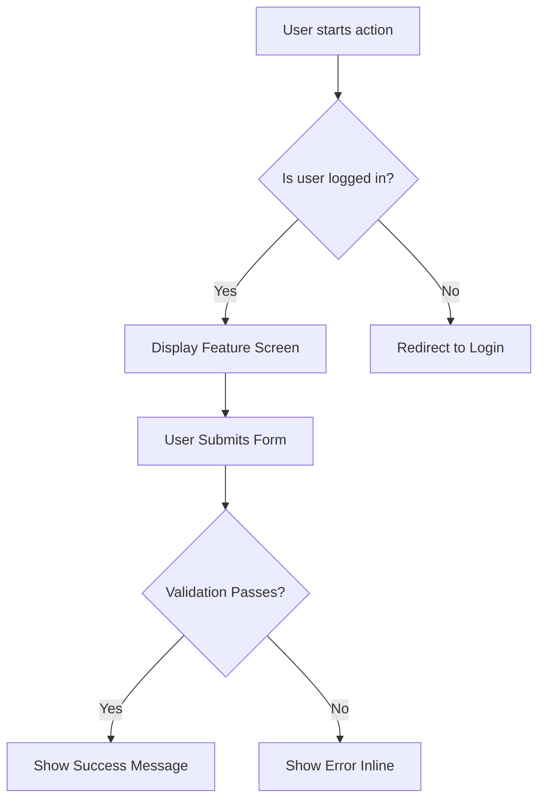
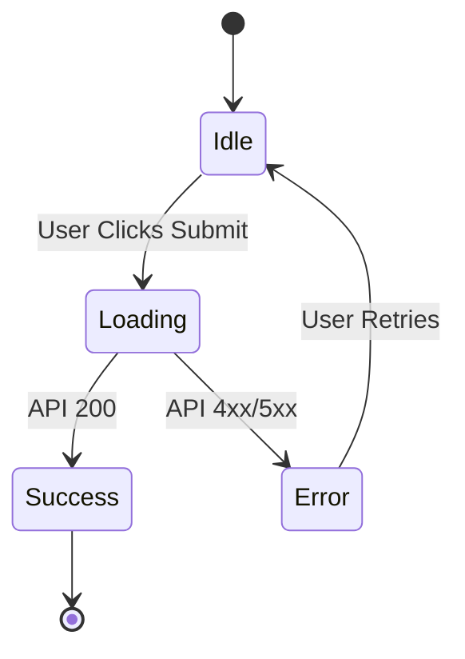

# Functional Specifications: [Feature Name]

## 1. General Overview

- **Summary:** [Brief 2-line description of the feature]
- **Scope:** [IN / OUT]

## 2. Business Process & Decision Workflow

_Use this flowchart to detail the complete navigation or user decision matrix:_

## 3. Detailed UI/UX Requirements

- **Required Visual Elements:** [Buttons, forms, alerts]
- **State Machine (UI States):**

## 4. Business Rules Matrix & Edge Cases

- Matrix of functional constraints and network disconnect scenarios.
