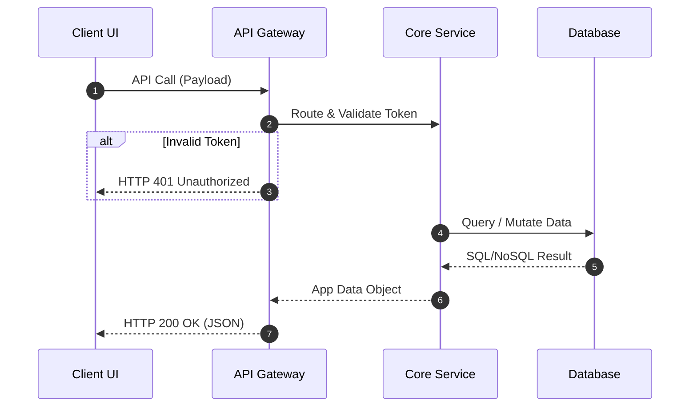
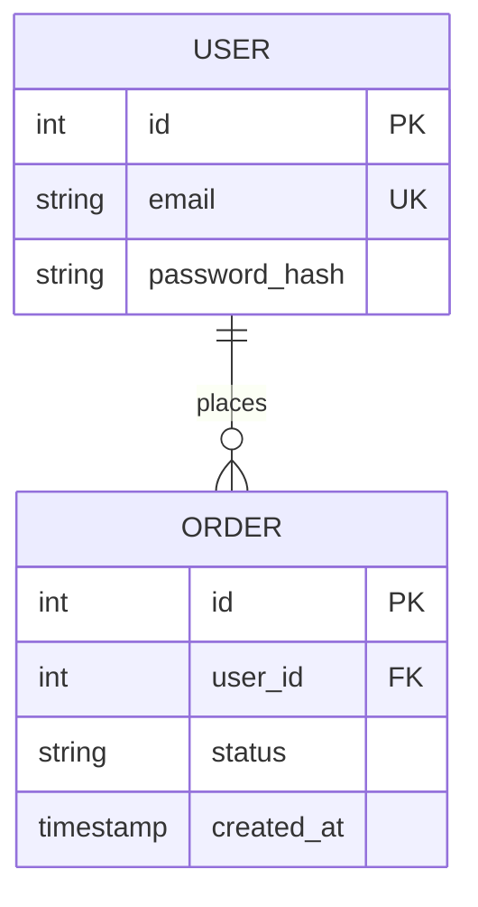

# Technical Specifications: [Component Name]

## 1. Tech Stack & Dependencies

- **Technologies:** [Languages, frameworks, libraries]

## 2. System Architecture & Data Flow

_Use this sequence diagram to trace data lifecycle and internal API transitions:_

## 3. Database Entity Relationship Diagram (ERD)

_Define any schema updates or new tables here:_

## 4. Performance, Security & Deployment

- [JWT Authentication, API Contracts, Variables]
