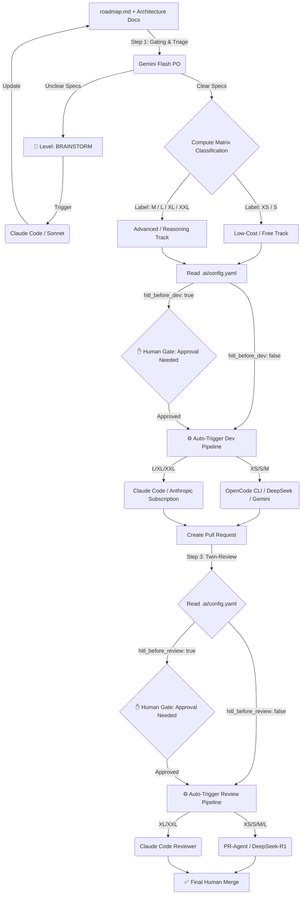

**WORK IN PROGESS**

# Smart-AI-Factory 🚀 (v1.0.0)

**Smart-AI-Factory** is an open-source, agnostic AI-DevOps framework designed to automate and self-regulate your entire software development lifecycle—from Roadmap to Pull Request—while slashing your AI API costs by up to 80%. 

Instead of using a single, expensive LLM for every task, **Smart-AI-Factory** acts as a **smart routing engine**. It evaluates task complexity upfront and delegates both the development and the code review to the most optimal, cost-efficient twin-model setup available on the market. 

## 🔄 End-to-End Workflow Architecture



## 🔄 Concrete 3-Step Lifecycle

1. **The Gating (Gemini Flash PO):** Every `git push` on `roadmap.md` wakes up Gemini 2.5 Flash via Google AI Studio. It reads your product goals and checks your existing `/docs/architecture.md`. If it detects missing specifications or technical blind spots, it automatically creates a GitHub issue labeled `Brainstorm`. Otherwise, it outputs a clean backlog of ready-to-dev issues labeled from **XS** to **XXL**.
2. **The Brainstorm Relay (Claude Code):** If a `Brainstorm` issue is opened, **Claude Code (Sonnet)** takes over the ticket. It reads your project structure, chats with you in the issue comments to resolve the ambiguity, and updates your `/docs/architecture.md` file before any code is generated.
3. **The Execution & Twin-Review:** Once an issue is clear and labeled `dev-ia`, the automated routing checks `.ai/config.yaml`. It passes through human approval if required, invokes the right developer model (DeepSeek or Claude), submits a PR, and wakes up a separate review agent to enforce quality gates before your final human merge.

## 🧠 Local-First Synchronization & Anti-Duplication

One of the core features of **Smart-AI-Factory** is its **State & Code-Presence Awareness**. The system never fights with itself or overwrites manual work. It natively supports two distinct operational modes:

1. **Asynchronous Mode (Full-DevOps):** You update `roadmap.md` ➡️ GitHub creates the issue ➡️ GitHub Actions codes the feature ➡️ It opens the PR.
2. **Short-Circuit Mode (Local-First):** You update `roadmap.md` ➡️ You build the feature locally using your Code local chat (DeepSeek/Qwen) ➡️ You push the finished code.

### How does the pipeline avoid duplicates when you code locally?

- **Triage Sync:** When Gemini Flash triggers on a `git push`, its parsing skill doesn't just read the `roadmap.md`. The workflow injects the current project tree structure into the prompt context. If a task says `[ ] Create Button component` but Gemini detects that `src/components/Button.tsx` already exists with valid code, it automatically updates the roadmap to `[x]` and skips issue creation.
- **Dev Gatekeeping:** If an issue is already open on GitHub but you decide to solve it locally, the automated Dev pipeline will instantly halt if it detects that the issue has been linked to an open Pull Request or closed manually. It will automatically bypass the coding agent and jump straight to the **Twin-Review** phase to validate your local work.

## 📁 Repository Structure

The framework is highly modular and entirely driven by simple Markdown and YAML files stored in the .ai/ directory: 

```text

├── .github/workflows/
│   ├── ai_triage_pipeline.yml     # Step 1: Roadmap -> Triage & Labeling
│   └── ai_routing_pipeline.yml    # Step 2 & 3: Dev Execution & Review Routing
├── .ai/
│   ├── config.yaml                # 🎛️ Governance Control Center (HITL & Model Mapping)
│   ├── skills/
│   │   ├── roadmap_parser.md      # Parsing logic for feature extraction
│   │   └── complexity_gating.md   # Complexity evaluation scoring rules
│   ├── dev_agents/                # 🛠️ Coding profiles (6 levels from XS to XXL)
│   │   ├── xs_coder.md, s_coder.md, m_coder.md, l_coder.md, xl_coder.md, xxl_coder.md
│   └── review_agents/             # 🔍 Code Reviewer profiles (3 unified tiers)
│       ├── fast_reviewer.md       # Sanity checks (XS/S)
│       ├── tech_reviewer.md       # Algorithmic & test coverage validation (M/L)
│       └── archi_reviewer.md      # Heavy architecture alignment validation (XL/XXL)
├── CLAUDE.md                      # Identity file natively read by Claude Code
└── README.md                      # Framework manifesto and documentation
```

## 🎛️ Governance & Routing Matrix

Through .ai/config.yml, you can toggle **Human-in-the-Loop (HITL)** gates independently for each task size. This allows a team to run fully automated for small adjustments while enforcing strict human oversight for large architectural changes. 

| Level          | Dev Agent           | Review Agent     | Tech Stack (Default)              | Target Task                                                                                                                                        | HITL Gates (Configurable)      | Cost Profile                     |
| -------------- | ------------------- | ---------------- | --------------------------------- | -------------------------------------------------------------------------------------------------------------------------------------------------- | ------------------------------ | -------------------------------- |
| **Triage**     | `Gemini Flash PO`   | _N/A_            | Google AI Studio                  | **Backlog Generation**: Automatically triggered on `roadmap.md` changes. Parses goals, checks architectural alignment, and creates labeled issues. | **No** (Fully Automated)       | **Free Tier** (Google AI Studio) |
| **Brainstorm** | `claude-3-5-sonnet` | _N/A_            | Claude Code                       | **Ambiguous .Specifications**: Pipeline halts; Claude refines the design and updates architecture docs first.                                      | **Mandatory**                  | _Subscription_                   |
| **XS**         | `xs_coder`          | `fast_reviewer`  | OpenCode + Gemini Flash Lite      | **Intern**: Typo fixes, variable renaming, simple label updates.                                                                                   | `dev: false` / `review: false` | **Free**                         |
| **S**          | `s_coder `          | `fast_reviewer`  | OpenCode + DeepSeek-V3            | **Junior Dev**: Simple conditional statements, isolated micro-components.                                                                          | `dev: false` / `review: false` | **~$0.01**                       |
| **M**          | `m_coder `          | `tech_reviewer`  | OpenCode + DeepSeek-R1            | **Mid Dev**: Standard business logic, mandatory unit test authoring.                                                                               | `dev: true` / `review: false`  | **~$0.05**                       |
| **L**          | `l_coder `          | `tech_reviewer`  | Claude Code (`claude-3-5-haiku`)  | **Senior Dev**: Local refactoring, standard full feature building.                                                                                 | `dev: true` / `review: false`  | _Subscription_                   |
| **XL**         | `xl_coder`          | `archi_reviewer` | Claude Code (`claude-3-5-sonnet`) | **Tech Lead**: Large module development, new API integrations.                                                                                     | `dev: true` / `review: true`   | _Subscription_                   |
| **XXL**        | `xxl_coder`         | `archi_reviewer` | Claude Code (`claude-3-5-sonnet`) | **Principal Eng**: Core system overhauls + mandatory `architecture.md` updates.                                                                    | `dev: true` / `review: true`   | _Subscription_                   |

## 🚀 Quick Start

1. Clone this repository or copy the .ai/ and .github/ directories to the root of your project.
2. Set up your GitHub Repository Secrets (Settings > Secrets and variables > Actions): 

- OPENROUTER_API_KEY: For your pay-as-you-go models (DeepSeek, Gemini).
- CLAUDE_OAUTH_TOKEN: To authenticate Claude Code headless sessions inside your CI/CD using your active subscription.

3. Configure your coding standards, tech stack, and build scripts inside CLAUDE.md.
4. Define your product goals in roadmap.md and trigger the triage pipeline!

## 💻 Local IDE Integration (FinOps Setup)

To track your AI expenses accurately, this framework is designed to run with granular API keys (e.g., separate keys for Chat, Autocomplete, and CI/CD).

We provide plug-and-play configurations for the most popular AI-driven IDEs. Choose your editor guide below to set up your local workspace in seconds:

- [Visual Studio Code Configuration Guide](.ai/docs/ide/vscode.md)
- [Cursor Configuration Guide](.ai/docs/ide/cursor.md) _(Coming Soon)_
- [Windsurf Configuration Guide](.ai/docs/ide/windsurf.md) _(Coming Soon)_

> ⚠️ **Note on Local FinOps Responsibility:** Unlike the cloud pipeline which auto-routes your tasks using Gemini, **you are the router in your local IDE**. To protect your wallet, you should manually split your workload: for example in vscode, use the `Continue.dev` side-panel with low-cost cloud models (DeepSeek-V3/R1) for small to mid-sized tasks, and invoke `Claude Code` in your terminal only for heavy, multi-file structural changes to leverage your fixed subscription.

## 🧠 Framework Philosophy

The engineering landscape has evolved. A developer's core value is no longer about writing repetitive boilerplate code, nor is it about blindly exhausting monthly AI commercial credits on trivial tasks. 

True expertise lies in **orchestrating smart systems, engineering contextual loops, and optimizing computational run-time infrastructure.** 

**Smart-AI-Factory** provides the governance layer that lets tech organizations scale up their output safely—keeping engineering teams fully in control of the codebase, the architecture, and the budget. 

_Framework designed and maintained by [fletort], AI-DevOps Architect & Lead Tech._
