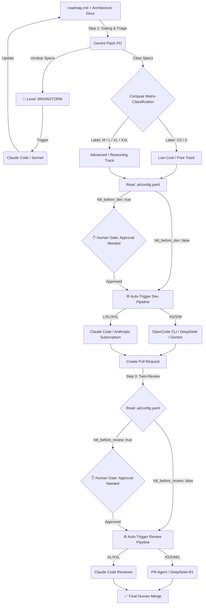

**WORK IN PROGESS**

### Smart-AI-Factory 🚀 (v1.0.0)

**Smart-AI-Factory** is an open-source, agnostic AI-DevOps framework designed to automate and self-regulate your entire software development lifecycle—from Roadmap to Pull Request—while slashing your AI API costs by up to 80%. 

Instead of using a single, expensive LLM for every task, **Smart-AI-Factory** acts as a **smart routing engine**. It evaluates task complexity upfront and delegates both the development and the code review to the most optimal, cost-efficient twin-model setup available on the market. 

### 🔄 End-to-End Workflow Architecture



### 📁 Repository Structure

The framework is highly modular and entirely driven by simple Markdown and YAML files stored in the .ai/ directory: 

```text

├── .github/workflows/
│   ├── ai_triage_pipeline.yml     # Step 1: Roadmap -> Triage & Labeling
│   └── ai_routing_pipeline.yml    # Step 2 & 3: Dev Execution & Review Routing
├── .ai/
│   ├── config.yaml                # 🎛️ Governance Control Center (HITL & Model Mapping)
│   ├── skills/
│   │   ├── roadmap_parser.md      # Parsing logic for feature extraction
│   │   └── complexity_gating.md   # Complexity evaluation scoring rules
│   ├── dev_agents/                # 🛠️ Coding profiles (6 levels from XS to XXL)
│   │   ├── xs_coder.md, s_coder.md, m_coder.md, l_coder.md, xl_coder.md, xxl_coder.md
│   └── review_agents/             # 🔍 Code Reviewer profiles (3 unified tiers)
│       ├── fast_reviewer.md       # Sanity checks (XS/S)
│       ├── tech_reviewer.md       # Algorithmic & test coverage validation (M/L)
│       └── archi_reviewer.md      # Heavy architecture alignment validation (XL/XXL)
├── CLAUDE.md                      # Identity file natively read by Claude Code
└── README.md                      # Framework manifesto and documentation
```

### 🎛️ Governance & Routing Matrix

Through .ai/config.yml, you can toggle **Human-in-the-Loop (HITL)** gates independently for each task size. This allows a team to run fully automated for small adjustments while enforcing strict human oversight for large architectural changes. 

| Level          | Dev Agent           | Review Agent     | Tech Stack (Default)              | Target Task                                                                                                   | HITL Gates (Configurable)      | Cost Profile   |
| -------------- | ------------------- | ---------------- | --------------------------------- | ------------------------------------------------------------------------------------------------------------- | ------------------------------ | -------------- |
| **Brainstorm** | `claude-3-5-sonnet` | _N/A_            | Claude Code                       | **Ambiguous .Specifications**: Pipeline halts; Claude refines the design and updates architecture docs first. | **Mandatory**                  | _Subscription_ |
| **XS**         | `xs_coder`          | `fast_reviewer`  | OpenCode + Gemini Flash Lite      | **Intern**: Typo fixes, variable renaming, simple label updates.                                              | `dev: false` / `review: false` | **Free**       |
| **S**          | `s_coder `          | `fast_reviewer`  | OpenCode + DeepSeek-V3            | **Junior Dev**: Simple conditional statements, isolated micro-components.                                     | `dev: false` / `review: false` | **~$0.01**     |
| **M**          | `m_coder `          | `tech_reviewer`  | OpenCode + DeepSeek-R1            | **Mid Dev**: Standard business logic, mandatory unit test authoring.                                          | `dev: true` / `review: false`  | **~$0.05**     |
| **L**          | `l_coder `          | `tech_reviewer`  | Claude Code (`claude-3-5-haiku`)  | **Senior Dev**: Local refactoring, standard full feature building.                                            | `dev: true` / `review: false`  | _Subscription_ |
| **XL**         | `xl_coder`          | `archi_reviewer` | Claude Code (`claude-3-5-sonnet`) | **Tech Lead**: Large module development, new API integrations.                                                | `dev: true` / `review: true`   | _Subscription_ |
| **XXL**        | `xxl_coder`         | `archi_reviewer` | Claude Code (`claude-3-5-sonnet`) | **Principal Eng**: Core system overhauls + mandatory `architecture.md` updates.                               | `dev: true` / `review: true`   | _Subscription_ |

### 🚀 Quick Start

1. Clone this repository or copy the .ai/ and .github/ directories to the root of your project.
2. Set up your GitHub Repository Secrets (Settings > Secrets and variables > Actions): 

- OPENROUTER_API_KEY: For your pay-as-you-go models (DeepSeek, Gemini).
- CLAUDE_OAUTH_TOKEN: To authenticate Claude Code headless sessions inside your CI/CD using your active subscription.

3. Configure your coding standards, tech stack, and build scripts inside CLAUDE.md.
4. Define your product goals in roadmap.md and trigger the triage pipeline!

### 🧠 Framework Philosophy

The engineering landscape has evolved. A developer's core value is no longer about writing repetitive boilerplate code, nor is it about blindly exhausting monthly AI commercial credits on trivial tasks. 

True expertise lies in **orchestrating smart systems, engineering contextual loops, and optimizing computational run-time infrastructure.** 

**Smart-AI-Factory** provides the governance layer that lets tech organizations scale up their output safely—keeping engineering teams fully in control of the codebase, the architecture, and the budget. 

_Framework designed and maintained by [fletort], AI-DevOps Architect & Lead Tech._
