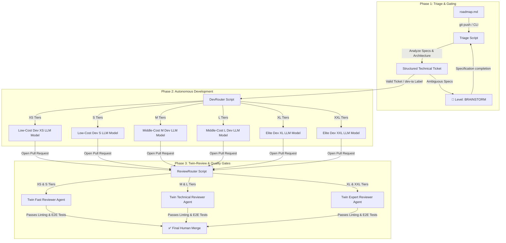

# Smart-AI-Factory 🚀 (WORK IN PROGRESS)

**Smart-AI-Factory** is an open-source, agnostic AI-DevOps framework designed to automate and self-regulate your entire software development lifecycle—from Roadmap to Pull Request—while slashing your AI API costs.

Instead of blindly exhausting monthly commercial credits or using a single expensive LLM for every task, **Smart-AI-Factory** acts as a **centralized Semantic CLI & dynamic routing engine**. It evaluates task complexity upfront and orchestrates the most cost-efficient setup for **Triage**, **Automated Development**, and **Autonomous Code Review**.

## 💡 The Vision: End-to-End FinOps Autonomous DevOps Pipeline

Smart-AI-Factory decouples the **User Interface (Local Chat)** from the **Execution Engine (Core Scripts)**. A single configuration matrix governs the three core phases of your engineering loop, ensuring continuous alignment between your budget constraints and task complexity.

## 🎛️ Governance & Routing Matrix

Through `.ai/config.yaml`, you can toggle **Human-in-the-Loop (HITL)** gates independently for each task size. This enables teams to run fully automated production pipelines for small adjustments while enforcing strict human verification and high-tier models for development and code review.

| Level          | Dev Agent           | Review Agent     | Tech Stack (Default)              | Target Task                                                                                                                                        | HITL Gates (Configurable)      | Cost Profile                     |
| -------------- | ------------------- | ---------------- | --------------------------------- | -------------------------------------------------------------------------------------------------------------------------------------------------- | ------------------------------ | -------------------------------- |
| **Triage**     | `Gemini Flash PO`   | _N/A_            | Google AI Studio                  | **Backlog Generation**: Automatically triggered on `roadmap.md` changes. Parses goals, checks architectural alignment, and creates labeled issues. | **No** (Fully Automated)       | **Free Tier** (Google AI Studio) |
| **Brainstorm** | `claude-3-5-sonnet` | _N/A_            | Claude Code                       | **Ambiguous .Specifications**: Pipeline halts; Claude refines the design and updates architecture docs first.                                      | **Mandatory**                  | _Subscription_                   |
| **XS**         | `xs_coder`          | `fast_reviewer`  | OpenCode + Gemini Flash Lite      | **Intern**: Typo fixes, variable renaming, simple label updates.                                                                                   | `dev: false` / `review: false` | **Free**                         |
| **S**          | `s_coder`           | `fast_reviewer`  | OpenCode + DeepSeek-V3            | **Junior Dev**: Simple conditional statements, isolated micro-components.                                                                          | `dev: false` / `review: false` | **~$0.01**                       |
| **M**          | `m_coder`           | `tech_reviewer`  | OpenCode + DeepSeek-R1            | **Mid Dev**: Standard business logic, mandatory unit test authoring.                                                                               | `dev: true` / `review: false`  | **~$0.05**                       |
| **L**          | `l_coder`           | `tech_reviewer`  | Claude Code (`claude-3-5-haiku`)  | **Senior Dev**: Local refactoring, standard full feature building.                                                                                 | `dev: true` / `review: false`  | _Subscription_                   |
| **XL**         | `xl_coder`          | `archi_reviewer` | Claude Code (`claude-3-5-sonnet`) | **Tech Lead**: Large module development, new API integrations.                                                                                     | `dev: true` / `review: true`   | _Subscription_                   |
| **XXL**        | `xxl_coder`         | `archi_reviewer` | Claude Code (`claude-3-5-sonnet`) | **Principal Eng**: Core system overhauls + mandatory `architecture.md` updates.                                                                    | `dev: true` / `review: true`   | _Subscription_                   |

## 📖 Deep-Dive Documentation

To keep this manifesto clean and actionable, the framework's detailed technical operations and configuration requirements are split into specialized manuals:

- **💻 Local Workspace Integration:** [Visual Studio Code & Continue.dev Configuration Guide](docs/ide/vscode.md)  
   _Learn how to spin up your local multi-key Dev Container and how to manage your manual local FinOps choices._
- **🔄 Interactive Workspace Loops:** [Local Triage & Live Brainstorming Documentation](docs/pipelines/triage_local.md)  
   _Deep-dive into the interactive CLI terminal menus, live human approval mechanics, and local Claude Code bypass loops._
- **☁️ Cloud-Native Triage Workflows:** [Asynchronous CI/CD & Cloud Triage Rules](docs/pipelines/triage_cloud.md)  
   _Understand how GitHub Actions perform stateless triage, persist brainstorming context, and apply asynchronous human gates._

## 🚀 Quick Start

1. Clone this repository or copy the `.ai/`, `skills/`, `.claude/`, and `.github/` directories to the root of your project.
2. Set up your local environment file by copying `.continue/.env.template` to `.continue/.env` and adding your API keys.
3. Open your project using **Dev Containers** for a zero-friction, pre-configured workspace.
4. Define your product objectives inside `roadmap.md` and trigger the factory!

## 🧠 Framework Philosophy

The engineering landscape has evolved. A developer's core value is no longer about writing repetitive boilerplate code, nor is it about blindly exhausting monthly AI commercial credits on trivial tasks.

True expertise lies in **orchestrating smart systems, engineering contextual loops, and optimizing computational run-time infrastructure.**

**Smart-AI-Factory** provides the governance layer that lets tech organizations scale up their output safely—keeping engineering teams fully in control of the codebase, the architecture, and the budget.

---

_Framework designed and maintained by [fletort], AI-DevOps Architect & Lead Tech._
