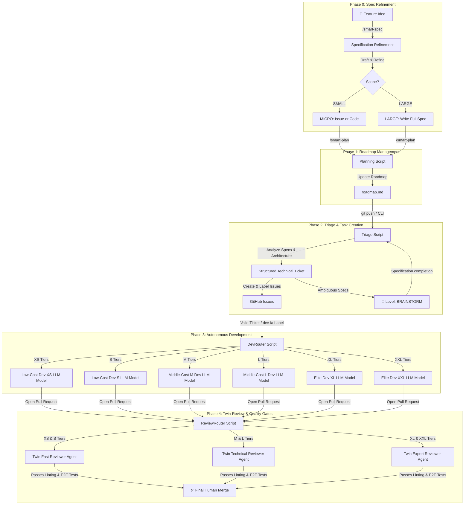

# Smart-AI-Factory 🚀 (WORK IN PROGRESS)

**Smart-AI-Factory** is an open-source, agnostic AI-DevOps framework designed to automate and
self-regulate your entire software development lifecycle—from Roadmap to Pull Request—while slashing
your AI API costs.

Instead of blindly exhausting monthly commercial credits or using a single expensive LLM for every
task, **Smart-AI-Factory** acts as a **centralized Semantic CLI & dynamic routing engine**. It
guides you through **Specification Refinement** and **Roadmap Management**, then orchestrates the
most cost-efficient setup for **Triage**, **Autonomous Development**, and **Code Review**.

## 💡 The Vision: End-to-End FinOps Autonomous DevOps Pipeline

Smart-AI-Factory decouples the **User Interface (Local Chat)** from the **Execution Engine (Core**
**Scripts)**. A single configuration matrix governs the five core phases of your engineering loop,
ensuring continuous alignment between your budget constraints and task complexity.

## 🎛️ Governance & Routing Matrix

Through `.smart.ai/config.yml`, you can toggle **Human-in-the-Loop (HITL)** gates independently for
each task size. This enables teams to run fully automated production pipelines for small adjustments
while enforcing strict human verification and high-tier models for development and code review.

| Level / Phase       | Default Agent               | Target Task                                                                                                                            | HITL Gates (Configurable)      | Cost Profile                     | Why (FinOps & Cognitive Justification)                                                                                                                                  |
| :------------------ | :-------------------------- | :------------------------------------------------------------------------------------------------------------------------------------- | :----------------------------- | :------------------------------- | :---------------------------------------------------------------------------------------------------------------------------------------------------------------------- |
| **Phase 0: Spec**   | `claude-3-5-sonnet`         | **Specification Refinement**: Surfaces blind spots using the 3-Question Rule. Evaluates scope (MICRO vs LARGE) and writes core specs.  | **Mandatory**                  | _Subscription / Commercial_      | This is the most cognitively demanding phase. It requires an "Elite-level" model to uncover blind spots, draft airtight specs, and avoid downstream development errors. |
| **Phase 1: Plan**   | `Gemini Flash Architect`    | **Roadmap & Scheduling**: Triggered via `/smart-plan`. Parses specs or chat context to build a macro, parallel-ready roadmap flow.     | **No** (Fully Automated)       | **Free Tier** (Google AI Studio) | High context input but small, macro-level output. A "Flash" model with a massive context window easily processes entire specs for zero cost on the Free Tier.           |
| **Phase 2: Triage** | `Gemini Flash PO`           | **Backlog Generation**: Automatically triggered on roadmap changes. Parses macro goals against specs to create detailed GitHub Issues. | **No** (Fully Automated)       | **Free Tier** (Google AI Studio) | Requires multiple incremental passes over the documentation to detail tasks. Using a "Flash" model ensures this high-frequency routing loop remains 100% cost-free.     |
| **Brainstorm**      | `claude-3-5-sonnet`         | **Ambiguous Specifications**: Pipeline halts; Claude refines the design and updates architecture docs first.                           | **Mandatory**                  | _Subscription / Commercial_      | Complex architectural blockers require deep semantic comprehension and interactive dialogue with the human architect to pivot safely.                                   |
| **XS**              | `xs_coder` (Flash Lite)     | **Intern**: Typo fixes, variable renaming, simple label updates.                                                                       | `dev: false` / `review: false` | **Free Tier**                    | Simple token-matching and string replacements do not require semantic reasoning; keeping it on sub-flash tiers ensures zero cost.                                       |
| **S**               | `s_coder` (DeepSeek-V3)     | **Junior Dev**: Simple conditional statements, isolated micro-components.                                                              | `dev: false` / `review: false` | **~\$0.01**                      | Basic programming logic and isolated tasks are highly optimized on standard commodity LLMs, yielding speed and cents-level billing.                                     |
| **M**               | `m_coder` (DeepSeek-R1)     | **Mid Dev**: Standard business logic, mandatory unit test authoring.                                                                   | `dev: true` / `review: false`  | **~\$0.05**                      | Standard features require explicit code reasoning and math verification. An "O1/R1-class" reasoning model guarantees solid logic and test coverage.                     |
| **L**               | `l_coder` (Claude Haiku)    | **Senior Dev**: Local refactoring, standard full feature building.                                                                     | `dev: true` / `review: false`  | _Subscription / Commercial_      | Multi-file code context manipulation demands high speed and strict adherence to local styles, perfectly fitting a fast, local premium agent.                            |
| **XL**              | `xl_coder` (Claude Sonnet)  | **Tech Lead**: Large module development, new API integrations.                                                                         | `dev: true` / `review: true`   | _Subscription / Commercial_      | Integrating new systems requires a model that excels at understanding complex, sprawling architectures without introducing regressions.                                 |
| **XXL**             | `xxl_coder` (Claude Sonnet) | **Principal Eng**: Core system overhauls + mandatory `architecture.md` updates.                                                        | `dev: true` / `review: true`   | _Subscription / Commercial_      | Massive structural overhauls and synchronization with architecture documents require an elite agent capable of executing sweeping, high-risk code changes.              |

## 📖 Deep-Dive Documentation

To keep this manifesto clean and actionable, the framework's detailed technical operations and
configuration requirements are split into specialized manuals:

- **📋 Specification Refinement:**
  [Smart-Spec: Refinement & Scope Evaluation](docs/pipelines/smart_spec.md)  
  _Learn how to refine feature ideas, apply the 3-Question Rule, evaluate scope (MICRO vs LARGE),
  and route to execution._
- **🎯 Planning & Roadmap Management:** [Smart-Plan: Scheduling](docs/pipelines/smart_plan.md)
  _Understand how to create/update roadmaps, and manage task dependencies (coming soon)._
- **💻 Local Workspace Integration:**
  [Visual Studio Code & Continue.dev Configuration Guide](docs/ide/vscode.md)  
  _Learn how to spin up your local multi-key Dev Container and how to manage your manual local
  FinOps choices._
- **🔄 Interactive Workspace Loops:**
  [Local Triage & Live Brainstorming Documentation](docs/pipelines/triage_local.md)  
  _Deep-dive into the interactive CLI terminal menus, live human approval mechanics, and local
  Claude Code bypass loops._
- **☁️ Cloud-Native Triage Workflows:**
  [Asynchronous CI/CD & Cloud Triage Rules](docs/pipelines/triage_cloud.md)  
  _Understand how GitHub Actions perform stateless triage, persist brainstorming context, and apply
  asynchronous human gates._
- **Native LLM Wiki Engine:**
  [Native LLM Wiki Engine for Smart-AI-Factory specification](docs/specs/native_llm_wiki.md)

## 🚀 Quick Start

1. Copy the `.continue/`, `.agents/` and `.github/` directories to the root of your project. Copy
   the content of the `templates/` directory to the root of your project.
2. Set up your local environment file by:
   1. copying `.continue/.env.template` to `.continue/.env`, `.env.template` to `.env` and adding
      your API keys.
   2. editing `.smart.ai/config.yml` to define your workspace configuration inside this file
3. Open your project using **Dev Containers** for a zero-friction, pre-configured workspace.
4. Start with `/smart-spec` to refine your feature idea
5. The specification is now complete. Roadmap planning and issue creation will be handled by a
   future planning workflow

## 🧠 Framework Philosophy

The engineering landscape has evolved. A developer's core value is no longer about writing
repetitive boilerplate code, nor is it about blindly exhausting monthly AI commercial credits on
trivial tasks.

True expertise lies in **orchestrating smart systems, engineering contextual loops, and optimizing
computational run-time infrastructure.**

**Smart-AI-Factory** provides the governance layer that lets tech organizations scale up their
output safely—keeping engineering teams fully in control of the codebase, the architecture, and the
budget.

---

_Framework designed and maintained by [fletort], AI-DevOps Architect & Lead Tech._
