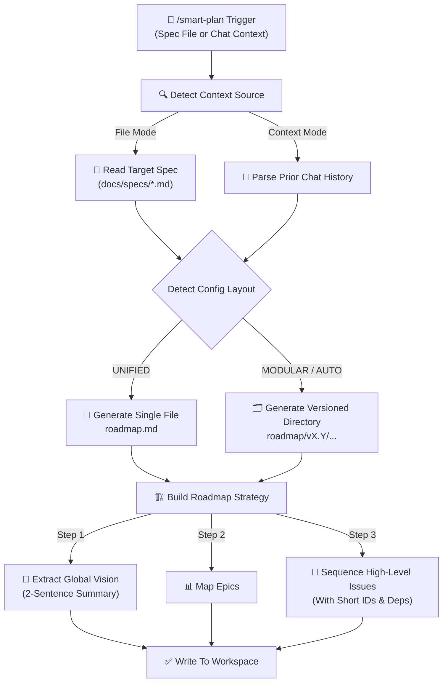

# Smart-Plan Execution Flow 🗺️

**State**: _Proposed specification_

This document visualizes the roadmap planning and milestone scheduling workflow of the
**smart-plan** skill (**Phase 1**).

## 🔄 Smart-Plan Workflow

The `smart-plan` skill acts as the bridge between raw or comprehensive specifications
[from Phase 0](./smart_spec.md) and the autonomous backlog triage (Phase 2). It transforms scope
definitions into high-level, parallel-ready roadmap files.

## Execution Routes

### Context & Sourcing Modes

- **File Mode**: Triggered when specifications files exist (from `smart-spec`
  [Case 3](./smart_spec.md#large--4-hours) or manual user specs). The agent anchors the roadmap to
  some persistents files pointers (docs/specs/).
- **Context Mode**: Triggered for smaller features or immediate feedback loops (`smart-spec`
  [Case 1](./smart_spec.md#smallmicro--4-hours)). The agent uses the active LLM conversational
  memory as the source of truth without generating boilerplate files.

### Storage & Layout Architecture

- Unique roadmap/versioned Roadmap: Project configuration is used to know if:
  - the roadmap is unique `roadmap.md` or `./roadmap/epic-X.md`
  - or by version `./roadmap/v0.1/roadmap.md` or `./roadmap/v0.1/epic-X.md`
- Single-File Layout: Optimized for small-to-medium project scopes. Generates or updates a
  standalone `roadmap.md` file at the root or within a versioned subdirectory.
- Multi-File Layout (Auto-Split): Activated by user configuration or triggered automatically if the
  project scope exceeds 3 Epics or a high volume of tasks. It outputs a `README.md` index file and
  individual `epic-X.md` files to prevent output token truncation and maintain readability.

## Key Principles

- **Macro-Level Scope Boundary**: Strictly avoid detailing technical implementation, coding steps,
  acceptance criteria, or code scripts. The output must focus entirely on what issues need to be
  created, not how to code them.
- **Parallel-Ready Sequencing**: Assign unique chronological IDs ([ISSUE-X]) to each entry and
  explicitly track blockers using a clean Depends on: tag. This leaves the door open for future
  multi-agent parallel orchestration.
- **FinOps Preservation**: Keep the output file sizes tight and clean to ensure that the Phase 2
  Triage Script can execute multiple runs without context crowding.
