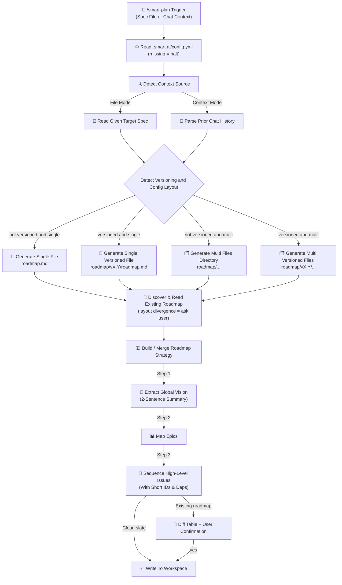

# Smart-Plan Execution Flow 🗺️

**State**: _Proposed specification_

This document visualizes the roadmap planning workflow of the **smart-plan** skill (**Phase 1**).

## 🔄 Smart-Plan Workflow

The `smart-plan` skill acts as the bridge between raw or comprehensive specifications
[from Phase 0](./smart_spec.md) and the autonomous backlog triage (Phase 2). It transforms scope
definitions into high-level, parallel-ready roadmap files.

```mermaid
graph TD
    Input["👤 /smart-plan Trigger<br/>(Spec File or Chat Context)"] --> Config["⚙️ Read .smart.ai/config.yml<br/>(missing = halt)"]
    Config --> Source["🔍 Detect Context Source"]

    Source -->|File Mode| ReadFile["📄 Read Given Target Spec"]
    Source -->|Context Mode| ReadChat["💬 Parse Prior Chat History"]

    ReadFile --> Strategy{"Detect Versioning and Config Layout"}
    ReadChat --> Strategy

    Strategy -->|not versioned and single| Single["📝 Generate Single File<br/>roadmap.md"]
    Strategy -->|versioned and single| SingleVer["📝 Generate Single Versioned File<br/>roadmap/vX.Y/roadmap.md"]
    Strategy -->|not versioned and multi| Multi["🗂️ Generate Multi Files Directory<br/>roadmap/..."]
    Strategy -->|versioned and multi| MultiVer["🗂️ Generate Multi Versioned Files <br/>roadmap/vX.Y/..."]

    Single --> Discover["🔎 Discover & Read Existing Roadmap<br/>(layout divergence = ask user)"]
    SingleVer --> Discover
    Multi --> Discover
    MultiVer --> Discover

    Discover --> Process["🏗️ Build / Merge Roadmap Strategy"]

    Process -->|Step 1| Vision["🎯 Extract Global Vision<br/>(2-Sentence Summary)"]
    Vision -->|Step 2| Epics["📊 Map Epics"]
    Epics -->|Step 3| Issues["🎫 Sequence High-Level Issues<br/>(With Short IDs & Deps)"]

    Issues -->|Clean slate| Output["✅ Write To Workspace"]
    Issues -->|Existing roadmap| Confirm["🧾 Diff Table + User Confirmation"]
    Confirm -->|yes| Output
```

## Execution Routes

### Context & Sourcing Modes

- **File Mode**: Triggered when a specification file exists (from `smart-spec`
  [Case 3](./smart_spec.md#large--4-hours) or manual user specs). The agent anchors the roadmap to
  persistent file pointers.
- **Context Mode**: Triggered for smaller features or immediate feedback loops (`smart-spec`
  [Case 1](./smart_spec.md#smallmicro--4-hours)). The agent appends the high-level issue title to
  the configured roadmap target using the current chat context as the source of truth, skipping the
  creation of a dedicated specification file.

### Configuration Pre-Condition

`.smart.ai/config.yml` is read first and on its own. If it is missing, the skill halts with
`❌**[smart-plan] Workspace not configured.**` and reads nothing else. Otherwise it announces the
detected configuration (`versioned` and `layout`) before continuing.

### Storage & Layout Architecture

- Unique roadmap/versioned Roadmap: `roadmap.versioned` configuration is used to know if:
  - the roadmap is unique `roadmap.md`
  - or by version `./roadmap/v0.1/roadmap.md`. The skill proposes the last available version and
    asks the user to confirm it or give a new one (and waits for the answer) before reading any
    version directory content.
- Single or Multi File Layout: `roadmap.layout` configuration is used to know the layout to use:
  - `single`: Single-File Layout: Optimized for small-to-medium project scopes. Generates or updates
    a standalone `roadmap.md` file at the root or within a versioned subdirectory.
  - `multi`: Multi-File Layout (Auto-Split): It outputs a `README.md` index file and individual
    `epic-X.md` files to prevent output token truncation and maintain readability.
  - `auto` (or not defined): Choose automatically between the single or multi layout. Multi-File
    layout is used if the project scope exceeds 3 Epics or have more than 50 tasks.

### Existing Roadmap Reconciliation

- **Discovery**: only the dedicated roadmap paths are read (never the workspace root): `roadmap.md`
  or `roadmap/README.md` (or the `roadmap/vX.Y/` equivalents). If the configured target is missing,
  the other layout location is checked before assuming a clean slate.
- **Layout Divergence**: if the filesystem contradicts the configured layout (e.g. `single` but
  `roadmap/README.md` exists), the skill stops and asks whether to migrate the layout or update the
  configuration.
- **Merge Rules**: an Epic whose `Pointer` matches the new source is updated; an unknown pointer
  always creates a new Epic (never added to an unrelated one). Existing `[ISSUE-X.Y]` IDs and
  checkboxes are preserved, new IDs continue after the highest existing one, and removed features
  are flagged `<!-- [DELETED] -->` or removed without shifting other IDs.
- **Confirmation**: a clean slate is written directly. For an existing roadmap, the skill shows a
  comparison table (modified, added, deleted, metadata) and writes only after the user types `yes`.

## Key Principles

- **Macro-Level Scope Boundary**: Strictly avoid detailing technical implementation, coding steps,
  acceptance criteria, or code scripts. The output must focus entirely on what issues need to be
  created, not how to code them.
- **Parallel-Ready Sequencing**: Assign unique epic-qualified IDs ([ISSUE-X.Y]) to each entry and
  explicitly track blockers using a clean Depends on: tag. This leaves the door open for future
  multi-agent parallel orchestration.
- **Spec Anchors**: Each Epic records a `Source Type` (File or Conversation Context) and a `Pointer`
  (spec path or `Current Conversation History`); in multi-file layout the root index also lists
  them.
- **FinOps Preservation**: Keep the output file sizes tight and clean to ensure that the Phase 2
  Triage Script can execute multiple runs without context crowding.
