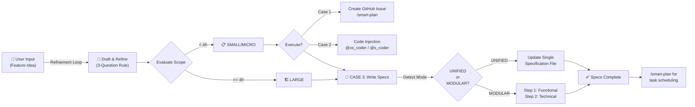

# Smart-Spec Execution Flow 📋

**State**: _Proposed specification_

This document visualizes the specification refinement and evaluation workflow of the **smart-spec**
skill.

## 🔄 Smart-Spec Workflow

The smart-spec skill guides you from a raw feature idea through specification refinement and scope
evaluation, then routes to the appropriate execution path.

## Execution Routes

### SMALL/MICRO (< 4 hours)

**Case 1**: Run `/smart-plan`

- Creates a standalone GitHub Issue
- Use when tracking/documentation is needed
- Single, well-scoped problem statement

**Case 2**: Activate Local Coder Agent

- `@xs_coder` or `@s_coder` for immediate code injection
- Use when feature is straightforward and implementation can start immediately
- Minimal specification overhead

### LARGE (> 4 hours)

**Case 3**: Phase/Epic with Full Specifications

1. **Permission**: Ask user approval to write comprehensive specs
2. **Mode Detection**: Load configuration to determine UNIFIED vs MODULAR structure
3. **Spec Writing**:
   - **UNIFIED**: Single specification document merging functional & technical needs
   - **MODULAR**: Separate functional spec (User Stories, workflows) → Technical spec (APIs,
     schemas, constraints)
4. **Validation**: Ensure specs match templates, maintain testable requirements
5. **Handoff**: User runs `/smart-plan` to handle roadmap updates and task scheduling

## Key Principles

- **Never assume missing details** → Use 3-Question Rule to surface blind spots
- **Scope boundary**: No task breakdowns, ticketing, or scheduling (belongs to `/smart-plan`)
- **Conflict alert**: Flag contradictions before applying spec changes
- **Testable requirements**: Keep specs precise and measurable, never vague
