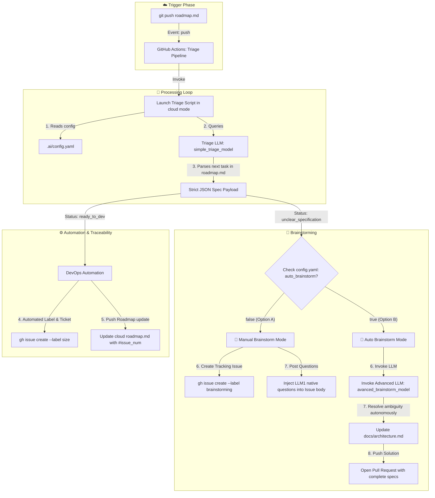

# Cloud Triage, Stateless CI/CD & Token Optimization ☁️

This document details the automation architecture, event-driven pipelines, and token-saving memory persistence mechanisms of the **Smart-AI-Factory** when running on GitHub Actions.

---

## 🔄 Cloud Execution Workflow

On the cloud, the framework operates in an **asynchronous, stateless mode**. Since virtual machines running your CI/CD destroy themselves after each run, the pipeline leverages the GitHub Issue interface as a live, low-cost distributed database to maintain conversation history without scanning the entire codebase repeatedly.



---

## 🎛️ Cloud Pipelines Specifications

The framework provisions two distinct GitHub Actions workflows inside `.github/workflows/` to segregate execution scopes and maximize billing efficiency:

### 1. `ai_triage_pipeline.yml`

- **Trigger:** Triggered exclusively on `push` events affecting the `roadmap.md` file on the main branch.
- **Action:** Runs the triage script in cloud mode. If the next item is clear, it creates the development issue. If it is blocked, it kicks off the Brainstorm environment and stops safely.
- **Billing footprint:** ~30 seconds of compute time per run.

### 2. `ai_routing_pipeline.yml`

- **Trigger:** Triggered on `issue_comment` events where the issue contains the label `brainstorming`.
- **Action:** Runs the brainstorm script. It feeds your manual answer directly into the conversational loop.
- **Billing footprint:** ~15 seconds of compute time per reply.

---

## 🔐 FinOps State Persistence Strategy: `<!-- FACTORY_CONTEXT -->`

The primary financial risk of running multi-turn AI agents on a CI/CD platform is **context re-ingestion**. If a virtual machine has to read your entire repository, your architecture docs, and your coding standards every time you post a 5-word comment on GitHub, the pipeline will burn thousands of unnecessary prompt tokens.

To prevent this, **Smart-AI-Factory** treats the GitHub Issue body as a cached memory bank.

### How it works

1. When the triage script detects an ambiguous specification, it extracts the relevant snippet of the roadmap and the specific architecture rule that was violated.
2. It stringifies this data into a compact JSON object and injects it as an invisible HTML comment inside the issue description:

   ```html
   ### 🛑 Technical Specifications Gaps Claude Code needs more inputs to clear
   this ticket. Please answer the questions below.

   <!-- FACTORY_CONTEXT {"roadmap_line": "- [ ] Setup Auth", "detected_gap": "Missing provider info", "schema_version": "1.0.0"} -->
   ```

3. When you write a comment on the web, the brainstorm script uses the GitHub CLI to download **only** the issue text and the comments thread.
4. The script strips the invisible `FACTORY_CONTEXT` out of the text and supplies it as the sole reference frame to the `advanced-brainstorming-llm-model`. **The codebase is never read during this phase.**

**Token Saving Result:** Prompt data payload drops from ~45,000 tokens (full project scanning) to less than ~1,500 tokens per discussion turn.

---

## ✋ Asynchronous Human Gateways

Because no terminal input buffer is available during cloud execution, the system translates your **HITL** requirements into native GitHub workflow authorizations:

- **Configuring `auto_brainstorm: false` (Cas A - Manual Refinement):** If the Triage LLM discovers an ambiguous task, the pipeline stops automated execution immediately. The script automatically provisions a GitHub Issue containing the model's native clarifying questions inside the issue body, freezing the backlog until a human engineer provides the missing technical inputs in the comments.
- **Configuring `hitl_during_triage: true` (Backlog Protection):** When a specification is flagged as `ready_to_dev` by the cloud engine, it creates the issue with a `pending-approval` state. The task remains unassigned to coding agents until an engineer removes the label or adds a 👍 emoji to the ticket description, ensuring no rogue automated code generation can occur on your repository.
