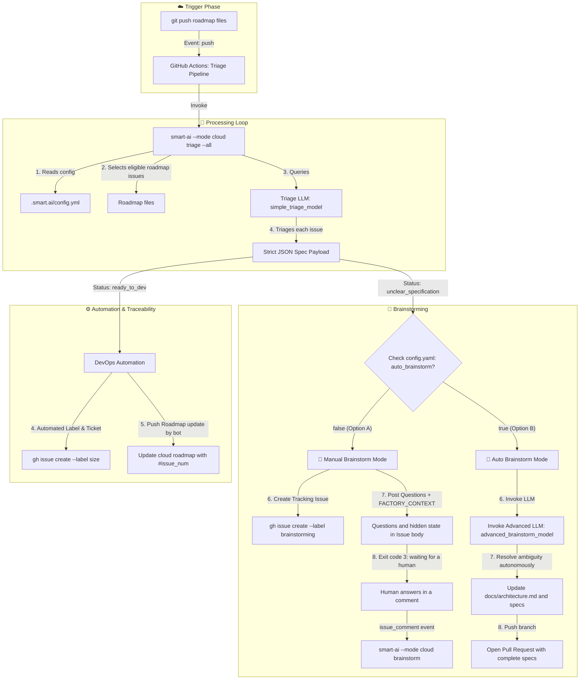

# Cloud Triage, Stateless CI/CD & Token Optimization ☁️

**State**: _Proposed specification (The specified files may not exist yet.)_

This document details the automation architecture, event-driven pipelines, and token-saving memory
persistence mechanisms of the **Smart-AI-Factory** when running on GitHub Actions.

The cloud pipelines run the **same `smart-ai` Python CLI** as the [local triage](./triage_local.md),
in `--mode cloud`. Technical design: [`smart-ai` CLI core](../specs/cli_core.md) and
[Triage engine](../specs/triage_engine.md). The triage consumes the roadmap produced by
[Smart-Plan](./smart_plan.md).

---

## 🔄 Cloud Execution Workflow

On the cloud, the framework operates in an **asynchronous, stateless mode**. Since virtual machines
running your CI/CD destroy themselves after each run, the pipeline leverages the GitHub Issue
interface as a live, low-cost distributed database to maintain conversation history without scanning
the entire codebase repeatedly.


```mermaid
graph TD
    subgraph "☁️ Trigger Phase"
        Git[git push roadmap files] -->|Event: push| CI_Triage[GitHub Actions: Triage Pipeline]
    end

    subgraph box1["🧠 Processing Loop"]
        CI_Triage -->|Invoke| CoreTriage[smart-ai --mode cloud triage --all]
        CoreTriage -->|1. Reads config| Config[.smart.ai/config.yml]
        CoreTriage -->|2. Selects eligible roadmap issues| RM0[Roadmap files]
        CoreTriage -->|3. Queries| LLM1[Triage LLM: simple_triage_model]
        LLM1 -->|4. Triages each issue| JSON1[Strict JSON Spec Payload]
    end

    subgraph "🛑 Brainstorming"
        JSON1 -->|"Status: unclear_specification"| CheckConfig{Check config.yaml: auto_brainstorm?}

        %% OPTION A : Stop & Open a Ticket
        CheckConfig -->|"false (Option A)"| CloudStop[🛑 Manual Brainstorm Mode]
        CloudStop -->|6. Create Tracking Issue| GH_BS[gh issue create --label brainstorming]
        CloudStop -->|7. Post Questions + FACTORY_CONTEXT| NativeComment[Questions and hidden state in Issue body]
        NativeComment -->|8. Exit code 3: waiting for a human| Wait[Human answers in a comment]
        Wait -->|issue_comment event| Resume[smart-ai --mode cloud brainstorm]

        %% OPTION B : Full Auto Brainstorm -> PR Direct
        CheckConfig -->|"true (Option B)"| CloudAuto[🤖 Auto Brainstorm Mode]
        CloudAuto -->|6. Invoke LLM| LLM2[Invoke Advanced LLM: advanced_brainstorm_model]
        LLM2 -->|7. Resolve ambiguity autonomously| Fix[Update docs/architecture.md and specs]
        Fix -->|8. Push branch| PR[Open Pull Request with complete specs]
    end

    subgraph "⚙️ Automation & Traceability"
        JSON1 -->|"Status: ready_to_dev"| DevOpCloud[DevOps Automation]
        DevOpCloud -->|4. Automated Label & Ticket| GH_Issue[gh issue create --label size]
        DevOpCloud -->|5. Push Roadmap update by bot| GitSync[Update cloud roadmap with #issue_num]
    end

```

---

## 🎛️ Cloud Pipelines Specifications

The framework provisions two distinct GitHub Actions workflows inside `.github/workflows/` to
segregate execution scopes and maximize billing efficiency:

### 1. `ai_triage_pipeline.yml`

- **Trigger:** Triggered exclusively on `push` events affecting one of the roadmap files. The
  roadmap file use can be:
  - in a single-file layout the unique `roadmap.md` file when unversioned or the
    `roadmap/vX.Y/roadmap.md` when versioned
  - in a multi-file layout, `roadmap/README.md`, `roadmap/epic-X.md` when unversioned, or
    `roadmap/vX.Y/README.md`, `roadmap/vX.Y/epic-X.md` when versioned.
- **Command:** `smart-ai --mode cloud triage --all`, run from the pinned PyPI package (for example
  `uvx smart-ai==X.Y.Z`).
- **Action:** Selects every eligible roadmap issue (not checked, no `(#N)` yet, dependencies already
  triaged). If an issue is clear, it creates the development issue and writes `(#N)` back to the
  roadmap in a bot commit. If it is blocked, it opens the brainstorm tracking issue and stops safely
  (exit code 3 is the expected "waiting for a human" outcome, not a failure).
- **Conversation Context epics:** an epic anchored on `Current Conversation History` has no spec
  file. The pipeline opens a tracking issue asking for that context, then the normal brainstorm loop
  applies.
- **Loop protection:** pushes made by the bot are ignored and runs are serialised with a
  `concurrency` group.
- **Billing footprint:** ~30 seconds of compute time per run.

### 2. `ai_routing_pipeline.yml`

- **Trigger:** Triggered on `issue_comment` events where the issue contains the label
  `brainstorming`.
- **Command:** `smart-ai --mode cloud brainstorm --issue <number>`.
- **Action:** Resumes the session from the issue content and feeds your answer into the
  conversational loop.
- **Authorisation:** runs only for comment authors that are `OWNER`, `MEMBER` or `COLLABORATOR`.
  Comment text is untrusted data: it is never interpolated into a shell script and is delimited as
  data in the prompts.
- **Billing footprint:** ~15 seconds of compute time per reply.

Both workflows use least-privilege `permissions` (`contents`, `issues`, `pull-requests` only where
needed) and must pass `actionlint` and `zizmor`.

---

## 🔐 FinOps State Persistence Strategy: `<!-- FACTORY_CONTEXT -->`

The primary financial risk of running multi-turn AI agents on a CI/CD platform is **context
re-ingestion**. If a virtual machine has to read your entire repository, your architecture docs, and
your coding standards every time you post a 5-word comment on GitHub, the pipeline will burn
thousands of unnecessary prompt tokens.

To prevent this, **Smart-AI-Factory** treats the GitHub Issue body as a cached memory bank.

### How it works

1. When the triage detects an ambiguous specification, it extracts the relevant snippet of the
   roadmap and the specific architecture rule that was violated.
2. It serialises this data into a compact, versioned JSON object (the `BrainstormState` of the
   [triage engine](../specs/triage_engine.md#52-state-persistence-factory_context)) and injects it
   as an invisible HTML comment inside the issue description:

   ```html
   ### 🛑 Technical specification gaps — the triage needs more inputs to clear this ticket. Please
   answer the questions below.

   <!-- FACTORY_CONTEXT {"schema_version": "1.0.0", "issue_id": "ISSUE-1.1", "roadmap_line": "- [ ] **[ISSUE-1.1]** - Setup Auth", "detected_gap": "Missing provider info"} -->
   ```

3. When you write a comment on the web, the brainstorm command uses the GitHub CLI to download
   **only** the issue text and the comments thread.
4. The CLI extracts and validates the invisible `FACTORY_CONTEXT`, and supplies it with the thread
   as the sole reference frame to the model (`simple_triage_model` for manual brainstorm,
   `advanced_brainstorm_model` for auto brainstorm). **The codebase is never read during this
   phase.** Unknown `schema_version` values are rejected explicitly.
5. Once the specification is clear, the issue is created (or the tracking issue is updated) with a
   hidden `<!-- smart-ai:issue-id=ISSUE-1.1 -->` marker, so a retry never produces a duplicate.

**Token Saving Result:** Prompt data payload drops from ~45,000 tokens (full project scanning) to
less than ~1,500 tokens per discussion turn.

---

## ✋ Asynchronous Human Gateways

Because no terminal input buffer is available during cloud execution, the system translates your
**HITL** requirements into native GitHub workflow authorizations:

- **Configuring `auto_brainstorm: false` (Case A - Manual Refinement):** If the Triage LLM discovers
  an ambiguous task, the pipeline stops automated execution immediately. The CLI automatically
  provisions a GitHub Issue containing the model's native clarifying questions inside the issue
  body, freezing the backlog until a human engineer provides the missing technical inputs in the
  comments.
- **Configuring `auto_brainstorm: true` (Case B - Autonomous Refinement):** The
  `advanced_brainstorm_model` resolves the ambiguity through the API. Its proposed changes to the
  specs and `docs/architecture.md` are committed on a dedicated branch and submitted as a **pull
  request**; nothing is pushed to the default branch, so a human always reviews them.
- **Configuring `hitl_during_triage: true` (Backlog Protection):** When a specification is flagged
  as `ready_to_dev` by the cloud engine, it creates the issue with a `pending-approval` state. In
  this way, the task remains unassigned to coding agents. Detailed documentation of this next phase
  (coding phase) will be added soon.
