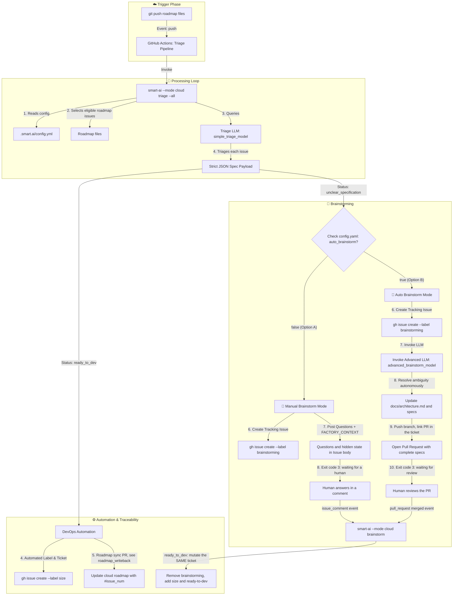

# Cloud Triage, Stateless CI/CD & Token Optimization ☁️

**State**: _Proposed specification (The specified files may not exist yet.)_

This document details the automation architecture, event-driven pipelines, and token-saving memory
persistence mechanisms of the **Smart-AI-Factory** when running on GitHub Actions.

The cloud pipelines run the **same `smart-ai` Python CLI** as the [local triage](./triage_local.md),
in `--mode cloud`. Technical design: [`smart-ai` CLI core](../specs/cli_core.md) and
[Triage engine](../specs/triage_engine.md). The triage consumes the roadmap produced by
[Smart-Plan](./smart_plan.md).

---

## 🔄 Cloud Execution Workflow

On the cloud, the framework operates in an **asynchronous, stateless mode**. Since virtual machines
running your CI/CD destroy themselves after each run, the pipeline leverages the GitHub Issue
interface as a live, low-cost distributed database to maintain conversation history without scanning
the entire codebase repeatedly.


```mermaid
graph TD
    subgraph "☁️ Trigger Phase"
        Git[git push roadmap files] -->|Event: push| CI_Triage[GitHub Actions: Triage Pipeline]
    end

    subgraph box1["🧠 Processing Loop"]
        CI_Triage -->|Invoke| CoreTriage[smart-ai --mode cloud triage --all]
        CoreTriage -->|1. Reads config| Config[.smart.ai/config.yml]
        CoreTriage -->|2. Selects eligible roadmap issues| RM0[Roadmap files]
        CoreTriage -->|3. Queries| LLM1[Triage LLM: simple_triage_model]
        LLM1 -->|4. Triages each issue| JSON1[Strict JSON Spec Payload]
    end

    subgraph "🛑 Brainstorming"
        JSON1 -->|"Status: unclear_specification"| CheckConfig{Check config.yaml: auto_brainstorm?}

        %% OPTION A : Stop & Open a Ticket
        CheckConfig -->|"false (Option A)"| CloudStop[🛑 Manual Brainstorm Mode]
        CloudStop -->|6. Create Tracking Issue| GH_BS[gh issue create --label brainstorming]
        CloudStop -->|7. Post Questions + FACTORY_CONTEXT| NativeComment[Questions and hidden state in Issue body]
        NativeComment -->|8. Exit code 3: waiting for a human| Wait[Human answers in a comment]
        Wait -->|issue_comment event| Resume[smart-ai --mode cloud brainstorm]

        %% OPTION B : Full Auto Brainstorm -> PR Direct
        CheckConfig -->|"true (Option B)"| CloudAuto[🤖 Auto Brainstorm Mode]
        CloudAuto -->|6. Create Tracking Issue| GH_BS2[gh issue create --label brainstorming]
        GH_BS2 -->|7. Invoke LLM| LLM2[Invoke Advanced LLM: advanced_brainstorm_model]
        LLM2 -->|8. Resolve ambiguity autonomously| Fix[Update docs/architecture.md and specs]
        Fix -->|9. Push branch, link PR in the ticket| PR[Open Pull Request with complete specs]
        PR -->|10. Exit code 3: waiting for review| Review[Human reviews the PR]
        Review -->|pull_request merged event| Resume
    end

    subgraph "⚙️ Automation & Traceability"
        JSON1 -->|"Status: ready_to_dev"| DevOpCloud[DevOps Automation]
        DevOpCloud -->|4. Automated Label & Ticket| GH_Issue[gh issue create --label size]
        DevOpCloud -->|5. Roadmap sync PR, see roadmap_writeback| GitSync[Update cloud roadmap with #issue_num]
        Resume -->|ready_to_dev: mutate the SAME ticket| Mutate[Remove brainstorming, add size and ready-to-dev]
    end

```

---

## 🎛️ Cloud Pipelines Specifications

The framework provisions two distinct GitHub Actions workflows inside `.github/workflows/` to
segregate execution scopes and maximize billing efficiency:

### 1. `ai_triage_pipeline.yml`

- **Trigger:** `push` events affecting a roadmap file, whatever its layout (single or multi,
  versioned or not, see [Smart-Plan](./smart_plan.md#storage--layout-architecture)).
- **Command:** `smart-ai --mode cloud triage --all`, run from the pinned PyPI package (for example
  `uvx smart-ai==X.Y.Z`).
- **Action:** Triages every eligible roadmap issue (rules in the
  [triage engine](../specs/triage_engine.md#23-eligibility)). Every issue gets its definitive GitHub
  ticket on its first run: `ready-to-dev` if the specification is clear, `brainstorming` if blocked.
  The `(#N)` link is synced to the roadmap, by default through an aggregated pull request so the
  branch protection is never bypassed. The run stops safely when a human is needed (exit code 3 is
  the expected "waiting for a human" outcome, not a failure).
- **Conversation Context epics:** an epic anchored on `Current Conversation History` has no spec
  file. The pipeline opens a tracking issue asking for that context, then the normal brainstorm loop
  applies.
- **Billing footprint:** ~30 seconds of compute time per run.

### 2. `ai_routing_pipeline.yml`

- **Trigger:** Triggered on `issue_comment` events where the issue contains the label
  `brainstorming`, and on `pull_request` closed events for the specification PRs opened by the auto
  brainstorm (branch `smart-ai/brainstorm-*` of this repository). A merge of such a PR is what
  resumes the triage: the `push` workflow is not triggered by it because it does not touch the
  roadmap files.
- **Command:** `smart-ai --mode cloud brainstorm --issue <number> --comment-id "$COMMENT_ID"` for a
  comment, or `smart-ai --mode cloud brainstorm --pr <number>` for a PR event. Event data is passed
  through environment variables, never interpolated into the script.
- **Action:** Resumes the session from the issue content (state machine:
  [triage engine](../specs/triage_engine.md#53-cloud-ticket-lifecycle-and-resume-triggers)). A
  comment feeds the conversational loop, a merged PR re-runs the triage on the merged
  specifications, and a PR closed without merge makes the ticket fall back to manual brainstorm.
- **Billing footprint:** ~15 seconds of compute time per reply.

### Safeguards (both workflows)

- **Loop protection:** the triage workflow is idempotent: a push that brings no eligible issue (for
  example the merge of a roadmap-sync PR) exits with code 0 before any LLM call. A `concurrency`
  group per ref serialises runs, so two runs cannot both miss the ticket marker. With
  `roadmap_writeback: direct`, pushes whose actor is the bot are also ignored. If
  `roadmap_writeback: pr` is enabled, the system MUST use an isolated, unique branch per run (e.g.,
  `smart-ai/roadmap-sync-${run_id}`) instead of a single shared branch to prevent concurrent
  writeback collisions and data loss across different refs.
- **Comment authorisation:** `issue_comment` runs only for authors whose association is `OWNER`,
  `MEMBER` or `COLLABORATOR`. Comment text is untrusted data: it is passed through a file or an
  environment variable, never interpolated into a `run:` script (this also keeps the workflows
  compliant with `zizmor`).
- **Merge event trust:** the `pull_request` trigger only acts on `smart-ai/brainstorm-*` branches
  whose head repository is this repository (never a fork). The merge is the human gate requiring a
  reviewer with write access under repository branch protection. To prevent cross-session race
  conditions, the system MUST explicitly bind the event by enforcing that the merged PR number
  equals `BrainstormState.pending_pr` and validating its tracking session marker before
  transitioning out of the `AwaitingPR` state.
- **Permissions:** least privilege per job: `contents: write` (roadmap sync and PR branches),
  `issues: write`, `pull-requests: write`, only where needed. Both workflows must pass `actionlint`
  and `zizmor`.
- **Failure mode:** on any non-zero exit code other than 3, the workflow comments the error summary
  on the tracking issue when one exists.

---

## 🔐 FinOps State Persistence Strategy: `<!-- FACTORY_CONTEXT -->`

The primary financial risk of running multi-turn AI agents on a CI/CD platform is **context
re-ingestion**. If a virtual machine has to read your entire repository, your architecture docs, and
your coding standards every time you post a 5-word comment on GitHub, the pipeline will burn
thousands of unnecessary prompt tokens.

To prevent this, **Smart-AI-Factory** treats the GitHub Issue body as a cached memory bank.

### How it works

1. When the triage detects an ambiguous specification, it extracts the relevant snippet of the
   roadmap and the specific architecture rule that was violated.
2. It serialises this data into a compact, versioned JSON object (the `BrainstormState` of the
   [triage engine](../specs/triage_engine.md#52-state-persistence-factory_context)) and embeds it as
   an invisible HTML comment in the issue description, with the human-readable questions:

   ```html
   ### 🛑 Technical specification gaps — the triage needs more inputs to clear this ticket. Please
   answer the questions below.

   <!-- FACTORY_CONTEXT: (encoded state, see the engine specification) -->
   ```

3. When you write a comment on the web, the brainstorm command uses the GitHub CLI to download
   **only** the issue text and the comments thread.
4. The CLI extracts and validates the invisible `FACTORY_CONTEXT` and uses it with the thread as the
   primary reference frame. **The full codebase is not scanned**; the bounded rehydration rules
   (spec file, explicitly named paths, token budget) are in the
   [triage engine](../specs/triage_engine.md#3-context-packing).
5. Once the specification is clear (human answers, or a merged specification PR), this same tracking
   issue is **mutated in place** and becomes the development issue, so the whole history (initial
   gap, discussion, specification PR) stays on the ticket. Labels and lifecycle:
   [triage engine](../specs/triage_engine.md#53-cloud-ticket-lifecycle-and-resume-triggers).

A hidden marker in the first ticket created identifies it for any pipeline retry, so a retry never
generates a duplicate
([triage engine](../specs/triage_engine.md#7-issue-creation--roadmap-write-back)).

**Token Saving Result:** Prompt data payload drops from ~45,000 tokens (full project scanning) to
less than ~1,500 tokens per discussion turn.

---

## ✋ Asynchronous Human Gateways

Because no terminal input buffer is available during cloud execution, the system translates your
**HITL** requirements into native GitHub workflow authorizations:

- **Configuring `auto_brainstorm: false` (Case A - Manual Refinement):** If the Triage LLM discovers
  an ambiguous task, the pipeline stops automated execution immediately. The CLI automatically
  provisions a GitHub Issue containing the model's native clarifying questions inside the issue
  body, freezing the backlog until a human engineer provides the missing technical inputs in the
  comments.
- **Configuring `auto_brainstorm: true` (Case B - Autonomous Refinement):** The
  `advanced_brainstorm_model` resolves the ambiguity through the API. Its proposed changes to the
  specs and `docs/architecture.md` are submitted as a **pull request** linked to the tracking issue;
  nothing is pushed to the default branch, so a human always reviews them. The triage resumes only
  once the PR is merged, so no development ticket is produced from unreviewed specifications. If the
  PR is closed without merge, the ticket falls back to manual brainstorm.
- **Configuring `hitl_during_triage: true` (Backlog Protection):** When a specification is flagged
  as `ready_to_dev` by the cloud engine, the ticket receives a `pending-approval` label instead of
  `ready-to-dev`. In this way, the task remains unassigned to coding agents until a maintainer
  replaces `pending-approval` with `ready-to-dev`. Detailed documentation of this next phase (coding
  phase) will be added soon.
