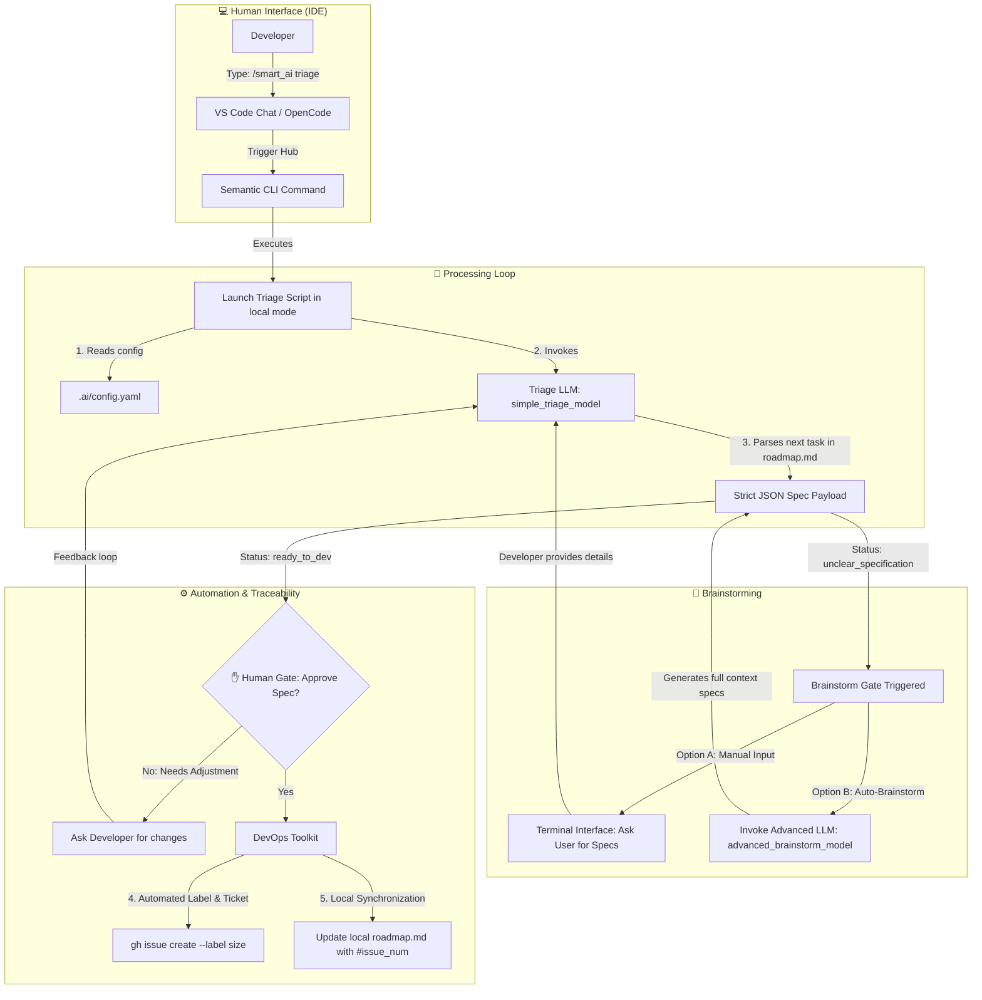

# Local Triage & Interactive Brainstorming Loops 💻

**State**: _Proposed specification_

This document details the architecture, terminal workflows, and Human-in-the-Loop (HITL) mechanics of the **Smart-AI-Factory** when executed locally inside your development workspace.

---

## 🔄 Local Execution Workflow

In your local IDE, the system operates in a **synchronous, state-present mode**. The execution is driven by the central orchestration script (`.ai/core/triage.js`) combined with the UI layer of your chat assistant (`skills/smart_ai.md`).



---

## 🎛️ Semantic CLI Integration: The `/smart_ai` Command

Instead of manually loading abstract prompt markdown files into your LLM prompt history, the framework abstracts the operations inside a single unified command palette visible by your local AI assistant (`skills/smart_ai.md`).

When you invoke `/smart_ai triage` inside `Continue.dev` or `OpenCode`:

1. The AI reads the semantic capabilities of the factory.
2. It triggers the background execution of `npm run factory:triage` (aliased to `node .ai/core/triage.js --local`).
3. The script handles data manipulation, configuration mapping, and interactive prompting directly within your integrated terminal.

---

## 🛑 The Local Brainstorming Loop: Resolving Ambiguities

If the Triage LLM (DeepSeek-V3 or Gemini) parses a line in `roadmap.md` and discovers missing constraints, loose requirements, or design pattern violations against your `docs/architecture.md`, it flags the JSON payload status as `unclear_specification`.

The local script intercepts this status, pauses the pipeline, and prints an interactive menu in your terminal:

```text
🛑 [Brainstorm] The task "Implement checkout system" is too ambiguous.
👉 Missing parameters: Payment Gateway Provider, Error Handing State, Webhook Strategy.

How do you want to proceed?
  1) Provide missing technical specifications manually
  2) Delegate to Advanced LLM (Auto-generate complete specs using Claude Sonnet)
  3) Abort triage session

[Select 1-3]: _
```

### 🔹 Option 1: Manual Human Enrichment

If you choose `1`, the terminal opens a text buffer. You type the exact missing business logic (e.g., _"Use Stripe, handle 402 payment required codes, log webhooks to database"_). The script appends your instructions to the prompt, re-invokes the low-cost Triage model, and updates the specification.

### 🔹 Option 2: Advanced LLM Bypass (The Claude Option)

If you choose `2`, the script bypasses manual input. It dynamically spins up your local **Claude Code** headless instance or uses your OpenRouter connection to invoke `claude-3-5-sonnet`. Claude reads your entire repository structure, cross-references it with your central `/docs/architecture.md`, designs the architectural contract automatically, and updates the specification payload to `ready_to_dev`.

---

## ✋ Human-in-the-Loop Gating (The Approval Step)

Once a technical task is clear and its weight is calculated (from **XS** to **XXL**), the framework forces an evaluation step. The terminal clears and displays a structured **FinOps Preview Card**:

```text
================================================================================
🔍 PROPOSED SPECIFICATION [Size: M]
================================================================================
Title:  [M] Secure API Endpoints with JWT Authentication
Goal:   Implement native json web token validation on all /api/v1 routes.
Inputs: Request Authorization Header Bearer String
Output: Decoded payload attached to request context, or 401 Unauthorized status.
Rules:  - Focus strictly on this scoped task. No future architecture.
        - Mandatory: Add unit tests under /tests/auth.test.js.
--------------------------------------------------------------------------------
💰 Est. CI/CD Cost: ~\$0.05 (Target Model: DeepSeek-R1)
================================================================================

✋ Approve this specification and provision GitHub infrastructure? (y/n/edit): _
```

- **`y` (Yes):** The script executes the native GitHub CLI command (`gh issue create`), fetches the new issue number, and surgically rewrites your local `roadmap.md` file (e.g., changing `- [ ] Secure API` to `- [ ] Secure API (#42)`).
- **`n` (No):** The session ends safely without polluting your Git state or GitHub backlog.
- **`edit`:** The script loops back to the Chat interface, allowing you to feed a prompt adjustment directly into the Triage LLM.

---

## 🧠 Local FinOps Best Practices

To optimize your local wallet footprint while working inside the IDE, always apply these human routing habits:

1. Leave **Autocomplete** to fast, focused models (`Codestral` or `Gemini Flash`). They are built for extreme speed and consume minimal token fractions per line.
2. Use `DeepSeek-V3` or `DeepSeek-R1` inside the **Continue Chat Panel** for quick edits, unit testing generation, and local roadmap evaluations.
3. Only type `claude` inside your terminal to spin up **Claude Code** when you need a completely autonomous agent capable of orchestrating heavy, multi-file architectural refactoring across your codebase.
