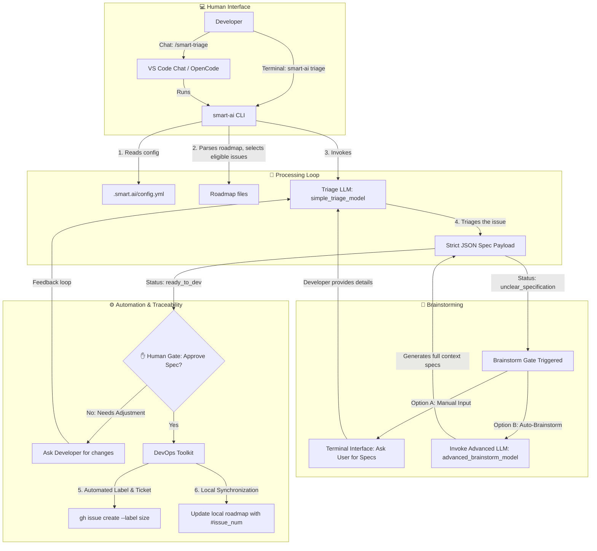

# Local Triage & Interactive Brainstorming Loops 💻

**State**: _Proposed specification (The specified files may not exist yet.)_

This document details the architecture, terminal workflows, and Human-in-the-Loop (HITL) mechanics
of the **Smart-AI-Factory** when executed locally inside your development workspace.

Technical design: [`smart-ai` CLI core](../specs/cli_core.md) and
[Triage engine](../specs/triage_engine.md). The triage consumes the roadmap produced by
[Smart-Plan](./smart_plan.md).

---

## 🔄 Local Execution Workflow

In your local IDE, the system operates in a **synchronous, state-present mode**. The execution is
driven by the `smart-ai` Python CLI (`smart-ai triage`), which can be typed directly in a terminal
or launched from your chat assistant through the `/smart-triage` skill (and, in the future, through
MCP).


```mermaid
graph TD
    subgraph "💻 Human Interface"
        User[Developer] -->|Terminal: smart-ai triage| CLI[smart-ai CLI]
        User -->|Chat: /smart-triage| Chat[VS Code Chat / OpenCode]
        Chat -->|Runs| CLI
    end

    subgraph "🧠 Processing Loop"
        CLI -->|1. Reads config| Config[.smart.ai/config.yml]
        CLI -->|2. Parses roadmap, selects eligible issues| RM0[Roadmap files]
        CLI -->|3. Invokes| LLM[Triage LLM: simple_triage_model]
        LLM -->|4. Triages the issue| JSON[Strict JSON Spec Payload]
    end

    subgraph "🛑 Brainstorming"
        JSON -->|"Status: unclear_specification"| BS[Brainstorm Gate Triggered]
        BS -->|Option A: Manual Input| Prompt[Terminal Interface: Ask User for Specs]
        Prompt -->|Developer provides details| LLM

        BS -->|Option B: Auto-Brainstorm| Claude[Invoke Advanced LLM: advanced_brainstorm_model]
        Claude -->|Generates full context specs| JSON
    end

    subgraph "⚙️ Automation & Traceability"
        JSON -->|"Status: ready_to_dev"| HITL{✋ Human Gate: Approve Spec?}

        HITL -->|No: Needs Adjustment| Adjust[Ask Developer for changes]
        Adjust -->|Feedback loop| LLM

        HITL -->|Yes| DevOp[DevOps Toolkit]
        DevOp -->|5. Automated Label & Ticket| GH[gh issue create --label size]
        DevOp -->|6. Local Synchronization| RM[Update local roadmap with #issue_num]
    end
```

---

## 🎛️ Entry Points

The triage is a plain Python CLI, installed once with `pipx install smart-ai` (or run on demand with
`uvx smart-ai`). It is the same program that runs in [GitHub Actions](./triage_cloud.md).

```bash
smart-ai config check          # validate .smart.ai/config.yml and API keys
smart-ai triage                # triage the next eligible roadmap issue
smart-ai triage --issue ISSUE-2.1
smart-ai --dry-run triage --all
```

The `/smart-triage` skill (Continue.dev, OpenCode, VS Code Chat) is only a thin wrapper that runs
the command and relays its questions to the chat. Like [`smart-spec`](./smart_spec.md) and
[`smart-plan`](./smart_plan.md), it stops immediately with `❌[smart-ai] Workspace not configured.`
when `.smart.ai/config.yml` is missing.

---

## 🗺️ Which Issues Are Triaged?

The triage reads the roadmap produced by [`smart-plan`](./smart_plan.md), following your `roadmap`
configuration (single or multi file, versioned or not). For a versioned roadmap, the latest version
is used unless `--roadmap-version` is given. If the filesystem contradicts the configuration, the
triage stops and asks whether to follow the filesystem or fix the configuration, exactly like
`smart-plan`.

A roadmap issue (`[ISSUE-X.Y]`) is **eligible** when it is not done, not already linked to a ticket,
and its dependencies are cleared (exact rules:
[triage engine](../specs/triage_engine.md#23-eligibility)). By default one issue is triaged per
local run; use `--limit N` or `--all` for more.

### Spec anchors

Each epic points to its specification (**Spec Anchors**):

- **File**: the triage reads the pointed spec (plus the wiki context, see
  [Native LLM Wiki](../specs/native_llm_wiki.md)).
- **Conversation Context**: no spec file exists, the specification was only discussed in a chat. The
  triage first **asks you for that context** (a description, or a path to a file). Only if it is not
  sufficient does the brainstorm loop start
  ([details](../specs/triage_engine.md#31-conversation-context-anchors)).

---

## 🛑 The Local Brainstorming Loop: Resolving Ambiguities

If the Triage LLM analyses a roadmap issue and discovers missing constraints, loose requirements, or
design pattern violations against your `docs/architecture.md`, it flags the JSON payload status as
`unclear_specification` (it asks at most 3 questions, like the 3-Question Rule of `smart-spec`).

With `auto_brainstorm: false` (default), the CLI pauses the pipeline and prints an interactive menu
in your terminal. With `auto_brainstorm: true`, it goes directly to option 2:

```text
🛑 [Brainstorm] The task "Implement checkout system" is too ambiguous.
👉 Missing parameters: Payment Gateway Provider, Error Handling State, Webhook Strategy.

How do you want to proceed?
  1) Provide missing technical specifications manually
  2) Delegate to Advanced LLM (Auto-generate complete specs using advanced_brainstorm_model)
  3) Abort triage session

[Select 1-3]: _
```

### 🔹 Option 1: Manual Human Enrichment

If you choose `1`, the terminal opens a text buffer. You type the exact missing business logic
(e.g., _"Use Stripe, handle 402 payment required codes, log webhooks to database"_). The script
appends your instructions to the prompt, re-invokes the low-cost Triage model, and updates the
specification.

### 🔹 Option 2: Advanced LLM Bypass (The Claude Option)

If you choose `2`, the script bypasses manual input and calls the model configured as
`advanced_brainstorm_model` (for example Claude Sonnet) through the same LLM layer as every other
call, so it works with any provider declared in your configuration. The model receives the packed
context (spec, wiki indexes, `docs/architecture.md`), takes the missing design decisions and
proposes the matching updates of the specification or architecture documents. You review and confirm
these file changes before they are written, then the triage is repeated and normally ends with
`ready_to_dev`.

A brainstorm is capped (`max_brainstorm_turns`, default 5) so that a stuck session cannot burn
budget; when the cap is reached the issue stays untriaged and the reason is displayed. The session
model is described in the [triage engine](../specs/triage_engine.md#5-brainstorm).

---

## ✋ Human-in-the-Loop Gating (The Approval Step)

Once a technical task is clear and its weight is calculated (from **XS** to **XXL**), the framework
forces an evaluation step. The terminal clears and displays a structured **FinOps Preview Card**:

```text
================================================================================
🔍 PROPOSED SPECIFICATION [Size: M]
================================================================================
Title:  [M] Secure API Endpoints with JWT Authentication
Goal:   Implement native json web token validation on all /api/v1 routes.
Inputs: Request Authorization Header Bearer String
Output: Decoded payload attached to request context, or 401 Unauthorized status.
Rules:  - Focus strictly on this scoped task. No future architecture.
        - Mandatory: Add unit tests under /tests/auth.test.js.
--------------------------------------------------------------------------------
💰 Est. CI/CD Cost: ~\$0.05 (Target Model: DeepSeek-R1)
================================================================================

✋ Approve this specification and provision GitHub infrastructure? (y/n/edit): _
```

- **`y` (Yes):** The script executes the native GitHub CLI command (`gh issue create`), fetches the
  new issue number, and adds `(#42)` to the matching line of your local roadmap file (e.g.,
  `- [ ] **[ISSUE-2.1]** - Secure API` becomes `- [ ] **[ISSUE-2.1]** (#42) - Secure API`). Nothing
  else in the roadmap is touched, and re-running after a failure never creates a duplicate
  ([rules](../specs/triage_engine.md#7-issue-creation--roadmap-write-back)).
- **`n` (No):** The session ends safely without polluting your Git state or GitHub backlog.
- **`edit`:** The CLI asks for your adjustment in the terminal (or the chat when launched through
  the skill) and feeds it into the Triage LLM, then displays the new card.

The gate is controlled by `hitl_during_triage` in `.smart.ai/config.yml`. `--dry-run` shows the
issue and the roadmap diff without creating or writing anything, and `--non-interactive` never
prompts (it exits with code 3 if an answer is required).

---

## 🧠 Local FinOps Best Practices

To optimize your local wallet footprint while working inside the IDE, always apply these human
routing habits:

1. Leave **Autocomplete** to fast, focused models (`Codestral` or `Gemini Flash`). They are built
   for extreme speed and consume minimal token fractions per line.
2. Use `DeepSeek-V3` or `DeepSeek-R1` inside the **Continue Chat Panel** for quick edits, unit
   testing generation, and local roadmap evaluations.
3. Only type `claude` inside your terminal to spin up **Claude Code** when you need a completely
   autonomous agent capable of orchestrating heavy, multi-file architectural refactoring across your
   codebase.
4. Set `max_cost_usd_per_run` in `.smart.ai/config.yml`: the CLI stops before exceeding it.
