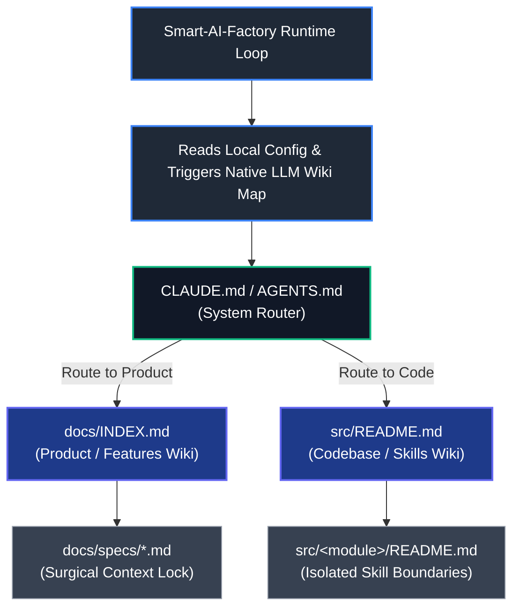

# Technical Sub-Specification: Native LLM Wiki Engine for Smart-AI-Factory

## 1. Scope, Intent & FinOps Context

To achieve true **Token-Less (token-efficient) execution**, `smart-ai` natively integrates the LLM
Wiki concept directly into its core lifecycle engine. Inspired by Andrej Karpathy's design
pattern—"Obsidian is the IDE; the LLM is the programmer; the wiki is the codebase"—this architecture
forces a structured, predictable, and hierarchical memory layout upon the project.

This document defines the technical sub-specification for the Native LLM Wiki Engine embedded within
the Smart-AI-Factory orchestration framework. This engine acts as a global architectural enabler for
the entire autonomous pipeline. Its primary mandate is to eliminate blind workspace crawls and
prevent context-window pollution. By forcing an interconnected, tree-structured markdown memory
layer across the repository, it enables Phase 0 (Spec Refinement), Phase 2 (Triage), and Phase 3
(Autonomous Dev) to target files surgically.

## 1.1 The FinOps Core Connection

In alignment with the Smart-AI-Factory Governance Matrix, this engine ensures that low-cost tier
models (e.g., Gemini Flash PO for Triage or xs_coder) consume minimal tokens. It restricts an
agent's visibility strictly to the relevant sub-nodes of the wiki, protecting the framework's strict
budget constraints (~$0.01 per standard issue).



## 2. Core LLM Wiki Topology (The Dual-Mirror Setup)

The smart-ai core engine expects, validates, and dynamically compiles a "Double-Mirror" directory
structure at the root of any automated repository:

### 2.1 The System Router: CLAUDE.md/AGENTS.md

Located at the root of the project. It must remain strictly under 50 lines to minimize the
system-prompt injection footprint of any routing script.

```markdown
# 🚀 [Project Name]

Welcome to the development repository of **[Project Name]**. This file outlines the general
development guidelines, routine commands, and agentic routing rules.

## 🛠️ Development & Environment Commands

- **Build Project:** `npm run build` _(or framework equivalent: e.g., cargo build, poetry build)_
- **Run Tests:** `npm run test` _(or pytest, cargo test)_
- **Lint & Format:** `npm run lint`

## 🤖 Smart-AI-Factory Integration (LLM Wiki)

> **Strict FinOps Token Rule:** This repository utilizes the `smart-ai` native LLM Wiki framework.
> To prevent massive token overhead and blind workspace crawls, follow the strict tree-traversal
> index layers below.

### 🧭 Agentic Routing Indices

- **Product Wiki (Features, Specs & Requirements):** Read [`docs/INDEX.md`](docs/INDEX.md) before
  writing or refactoring any feature logic.
- **Code Wiki (Architecture, Core Modules & Skills Map):** Read [`src/README.md`](src/README.md) to
  discover structural boundaries and local constraints before opening source files.
```

### 2.2 The Functional Branch (Product Wiki): docs/INDEX.md

Maps high-level business goals, requirements, and feature definitions. This index is primarily fed
by /smart-spec (Phase 0) and ingested by the Triage Script (Phase 2).
[Bootstrap of this documentation](../../templates/docs/INDEX.md) is proposed by the installation
process and can be personalised to your project:

```markdown
# 🗺️ Functional Specifications Index (Product Wiki)

| Feature / Skill Domain | Description & Capabilities                                 | Specification File                                     |
| :--------------------- | :--------------------------------------------------------- | :----------------------------------------------------- |
| **Agent Lifecycle**    | Core ReAct loop mechanics, orchestration states.           | [`specs/agent-lifecycle.md`](specs/agent-lifecycle.md) |
| **FinOps Routing**     | Budget evaluation rules, cost profile evaluation matrices. | [`specs/finops-routing.md`](specs/finops-routing.md)   |
| **GitHub Integration** | Webhook listeners, automated ticketing, issue labelling.   | [`specs/github-provider.md`](specs/github-provider.md) |
```

## 2.3 The Structural Branch (Code/Skills Wiki): src/README.md

Maps technical code boundaries, modules, and standalone Skills. No individual source code files
(.ts, .py, etc.) are allowed to be tracked in this top-level index.
[Bootstrap of this documentation](../../templates/src/README.md) is proposed by the installation
process and can be personalised to your project:

```markdown
# 🏗️ Codebase Architecture Index (Code Wiki)

| Module / Skill Folder | Technical Responsibility inside the SDK                         | Local Code-Wiki Link                       | Associated Spec                                                   |
| :-------------------- | :-------------------------------------------------------------- | :----------------------------------------- | ----------------------------------------------------------------- |
| **`src/core/`**       | LLM providers integration, cost counters, configuration parser. | [`src/core/README.md`](core/README.md)     | [`docs/specs/engine.md`](../docs/specs/engine.md)                 |
| **`src/skills/`**     | Registry for autonomous agent actions and pipeline plugins.     | [`src/skills/README.md`](skills/README.md) | [`docs/specs/skills-runtime.md`](../docs/specs/skills-runtime.md) |
```

## 3. Local Module Code-Wiki Template

Every subdirectory inside src/ must bundle a localized README.md. It forms an impenetrable semantic
boundary around that module.
[Bootstrap of this documentation](../../templates/src/_module_/README.md) is proposed by the
installation process and can be personalised to your project:

```markdown
# 📦 Module Code-Wiki: [MODULE_NAME] (e.g., auth, users, billing)

> **Agent Rule:** This file defines the explicit architectural scope and boundaries for the
> `src/[MODULE_NAME]/` directory. Adhere strictly to the entrypoints and constraints outlined below.

## 🔗 Contextual Anchors

- **Functional Specification:** [`docs/specs/[SPEC_FILE].md`](../../docs/specs/[SPEC_FILE].md)
- **Parent Architecture Index:** [`src/README.md`](../README.md)

## 📌 Critical Entrypoints & Files

- `[entrypoint_file_1.ext]` (e.g., `auth.controller.ts`) - **Purpose:** Main public API gateway /
  handler for incoming route requests.
- `[entrypoint_file_2.ext]` (e.g., `auth.service.ts`) - **Purpose:** Core business logic, token
  processing, and database interactions.
- `[types_file.ext]` (e.g., `types.ts`) - **Purpose:** Data schemas, internal models, and strict
  type definitions.

## 🛠️ Architecture & Data Flow

- Describe how data flows through this module in 2-3 concise bullets.
- _Example: Incoming HTTP requests hit the controller, parameters are validated via the types_
  _schema, and the payload is handed over to the service layer for processing._

## ⚠️ Architectural Constraints & Rules (Strict)

1. **Dependency Boundaries:** This module must remain decoupled. Never import directly from sibling
   feature modules. Use shared core utilities or event emitters instead.
2. **State Management:** All components in this directory must remain completely stateless. No local
   server-side caching or variable persistence is allowed outside the database layer.
3. **Error Handling:** All asynchronous database/network operations must be wrapped in localized
   `try/catch` blocks and piped into the application's central error handler.
```

## 4. Native Pipeline Integration Mechanics

### 4.1 Phase 2 (Triage Script) Automated Context Lock

When the Gemini Flash PO or a local triage routine receives an update on roadmap.md or a feature
ticket:

1. Tree Lookup: It reads CLAUDE.md/AGENTS.md ➡️ docs/INDEX.md ➡️ src/README.md to identify affected
   modules.
2. Surgical Context Packing: Instead of appending the whole codebase to the prompt, the engine loads
   only the specified file paths from the matching local Code-Wiki's Critical Entrypoints.
3. Validation Gate: If the Triage Script notes that a requirement is missing from the wiki or
   conflicts with constraints, it labels the ticket as 🛑 Level: BRAINSTORM, halting the pipeline
   for claude-3-5-sonnet refinement.

### 4.2 Phase 3 (DevRouter) Model-Size Budget Ingestion

Before dispatching a ticket to a specific development agent size (xs_coder to xxl_coder), the
DevRouter Script injects the local src/_module_/README.md into the agent's system instruction. This
ensures that a low-cost model (xs_coder) knows its exact structural limitations instantly, without
needing a high context window to understand the project architecture.

### 4.3 Automated Scaffolding Loop

When generating a new skill or DevOps script via the CLI:

- The framework automatically appends the entry row into src/README.md.
- It provisions the local README.md skeleton, ensuring the repository's LLM Wiki compiles and
  remains intact.
