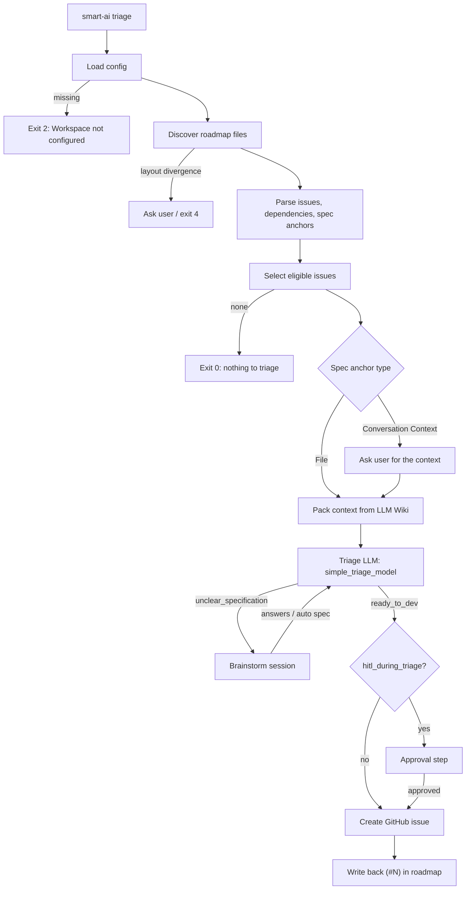

# Technical Specification: Triage Engine (Phase 2)

**State**: _Proposed specification (The specified files may not exist yet.)_

This document specifies the triage logic built on the [`smart-ai` CLI core](./cli_core.md). The
user-facing behaviour is described in [triage_local.md](../pipelines/triage_local.md) and
[triage_cloud.md](../pipelines/triage_cloud.md).

## 1. Scope

Triage turns **high-level roadmap issues** produced by [`smart-plan`](../pipelines/smart_plan.md)
into **detailed, sized GitHub issues**, asking for clarification (brainstorm) when a specification
is not precise enough. It does not write code (Phase 3) and does not create roadmaps (Phase 1).



## 2. Roadmap Discovery & Parsing

The parser reads **exactly the format written by `smart-plan`**. Any change to that format must be
reflected here.

### 2.1 Layout resolution

Inputs: `roadmap.versioned` and `roadmap.layout` from the config.

| versioned | layout   | Files read                                                                       |
| :-------- | :------- | :------------------------------------------------------------------------------- |
| false     | `single` | `roadmap.md`                                                                     |
| false     | `multi`  | `roadmap/README.md`, `roadmap/epic-X.md`                                         |
| true      | `single` | `roadmap/vX.Y/roadmap.md`                                                        |
| true      | `multi`  | `roadmap/vX.Y/README.md`, `roadmap/vX.Y/epic-X.md`                               |
| any       | `auto`   | Try the single then the multi location of the table above, the first match wins. |

- **Version selection** (versioned): the latest `vX.Y` directory by numeric order, overridable with
  `--roadmap-version vX.Y`. Unlike `smart-plan`, triage never invents a new version.
- **Divergence** (configuration says `single` but multi files exist, or the opposite): the same rule
  as `smart-plan` applies. Local: stop and ask whether to follow the filesystem or fix the config.
  Non-interactive or cloud: exit code 4 with the divergence described in the output. The triage
  never guesses.

### 2.2 Parsed model

```python
class SpecAnchor(BaseModel):
    source_type: Literal["file", "conversation"]
    pointer: str                      # "docs/specs/x.md" or "Current Conversation History"

class RoadmapIssue(BaseModel):
    id: str                           # "ISSUE-2.1" (stable, never renumbered)
    title: str
    checked: bool                     # "- [x]"; owned by the user, never modified
    issue_number: int | None          # parsed from "(#42)" if already triaged
    depends_on: list[str]             # [] when "None"
    epic: str                         # epic id
    anchor: SpecAnchor                # inherited from its epic
    file: Path
    line: int                         # for the surgical write-back
```

Recognised patterns (line based):

```text
- [ ] **[ISSUE-2.1]** - Title                 # optional "(#42)" right after the closing "**"
  - **Depends on:** None | [ISSUE-1.1], [ISSUE-1.2]
- **Source Type:** File | Conversation Context
- **Pointer:** `docs/specs/file.md` | `Current Conversation History`
```

A line that looks like an issue but does not match is reported as a warning and never silently
skipped.

### 2.3 Eligibility

An issue is **eligible** when all of the following hold:

1. It has no `(#N)` and no `<!-- [DELETED] -->` mark.
2. It is not checked.
3. Every ID in `depends_on` exists and has an issue number (or is checked).

Selection options: `--issue ISSUE-X.Y` (target one, dependencies still enforced), `--limit N`
(default 1 locally, all eligible in CI), `--all`. Eligible issues sharing the same blockers are
independent and may be triaged in the same run; they are processed sequentially, ordered by ID.

## 3. Context Packing

Goal: the smallest context that lets a low-cost model judge the issue.

1. **File anchor**: read the pointed spec file (error with a clear message if it does not exist).
2. **Wiki traversal** ([Native LLM Wiki](./native_llm_wiki.md) section 4.1): `AGENTS.md` /
   `CLAUDE.md` → `docs/INDEX.md` → `src/README.md` → matching module `README.md` files. Matching is
   done on the spec and issue text, deterministically first (names and links in the indexes), then
   by the LLM only if ambiguous.
3. **Architecture rules**: `docs/architecture.md` if it exists.
4. **Budget**: the packed context is capped (default 12,000 tokens, configurable); the lowest
   priority items are dropped first and the drop is reported in the output.
5. **Cloud mode**: no repository traversal beyond the spec file and wiki indexes. During a
   brainstorm turn in the cloud, **only** the issue thread and `FACTORY_CONTEXT` are used.

### 3.1 "Conversation Context" anchors

An epic anchored on `Current Conversation History` has no spec file. The flow is:

1. **Ask for the context first.** Local: the terminal prompts for a description of the feature
   (multi-line input, or a path to a file). MCP: `needs_input` of kind `brainstorm_question`. Cloud:
   the pipeline opens a tracking issue (label `brainstorming`) asking for the context, and stops.
2. Run the normal triage with that text as the specification.
3. If the model answers `unclear_specification`, the brainstorm loop starts.

The provided context is stored in `FACTORY_CONTEXT` (cloud) and, once the issue is created, in its
body, so it is never requested twice.

## 4. Triage LLM Contract

One call per issue, with the `simple_triage_model` alias and a Pydantic `response_model`:

```python
class TriageResult(BaseModel):
    status: Literal["ready_to_dev", "unclear_specification"]
    # always present
    rationale: str                          # one or two sentences, shown in logs only
    # when ready_to_dev
    size: Literal["XS", "S", "M", "L", "XL", "XXL"] | None
    title: str | None                       # "[M] Secure API Endpoints with JWT Authentication"
    goal: str | None
    inputs: str | None
    output: str | None
    rules: list[str] = []
    # when unclear_specification
    missing_parameters: list[str] = []
    questions: list[str] = []               # at most 3, see the 3-Question Rule of smart-spec
```

Validation beyond the schema:

- `ready_to_dev` requires `size`, `title`, `goal` and `output`; `unclear_specification` requires at
  least one question. A violation counts as an invalid structured output (one repair call, then exit
  code 5).
- The title must start with the `[SIZE]` prefix, enforced by the engine (it normalises, never trusts
  the model).
- `questions` is truncated to 3, consistent with the 3-Question Rule used by `smart-spec`.

The size drives the labels (`size:M`) and, in Phase 3, the DevRouter model tier.

## 5. Brainstorm

Triggered by `unclear_specification`. It is a resumable session (see
[cli_core.md](./cli_core.md#6-interaction-model-resumable-sessions)) with this state:

```python
class BrainstormState(BaseModel):
    schema_version: str = "1.0.0"
    issue_id: str
    roadmap_line: str
    spec_pointer: str
    detected_gap: str
    architecture_rule: str | None
    turns: list[Turn]                       # compact (role, text), oldest summarised
    mode: Literal["manual", "auto"]
```

### 5.1 Modes

- **Manual** (`auto_brainstorm: false`, or option 1 of the local menu): the questions of the triage
  model are given to the human. Each answer is appended to `turns`, then the triage call is repeated
  (cheap model). The loop ends when the result is `ready_to_dev` or the user aborts.
- **Auto** (`auto_brainstorm: true`, or option 2 of the local menu): the `advanced_brainstorm_model`
  is called through the same LLM layer (no external binary). It receives the packed context and the
  gap, and returns a `BrainstormResolution`: the decisions taken and a proposed update of
  `docs/architecture.md` / the spec. The triage call is then repeated with those decisions.
  - Local: the proposed file changes are shown and require confirmation before being written.
  - Cloud: changes are committed on a branch and submitted as a **pull request**, never pushed to
    the default branch.
- A session is limited to `max_brainstorm_turns` (default 5) to prevent runaway cost; reaching the
  limit leaves the issue untriaged and reports why.

### 5.2 State persistence (`FACTORY_CONTEXT`)

In cloud mode, the state is serialised in a hidden HTML comment of the tracking issue body:

```html
<!-- FACTORY_CONTEXT {"schema_version":"1.0.0","issue_id":"ISSUE-2.1","detected_gap":"…"} -->
```

On each reply, the CLI downloads only the issue body and its comments, extracts and validates the
JSON, and resumes. Unknown `schema_version` values are rejected with a clear message. The comment
size is capped (about 6,000 characters); when exceeded, the oldest turns are summarised by the
triage model.

## 6. Approval Step (`hitl_during_triage`)

- **Local**: a **FinOps Preview Card** is rendered (title, goal, inputs, output, rules, estimated
  cost of the future Phase 3 run for the size tier) and the user answers `y`, `n` or `edit`. `edit`
  adds free text as a new turn and repeats the triage call.
- **Cloud**: the issue is created with the `pending-approval` label instead of an interactive
  prompt. Removing that label is the approval (consumed by Phase 3).
- With `hitl_during_triage: false` the step is skipped in both modes.
- `--non-interactive` with `hitl_during_triage: true` locally exits with code 3 and lists the
  proposed issues, without creating anything.

## 7. Issue Creation & Roadmap Write-Back

1. **Idempotence marker**: every created issue body contains `<!-- smart-ai:issue-id=ISSUE-2.1 -->`
   and the title keeps the roadmap ID context in the body. Before creating, the tracker is searched
   for this marker; if found, creation is skipped and the existing number is used. This makes a
   retry after a failed write-back safe.
2. **Labels**: `size:<SIZE>` (and `pending-approval`, `brainstorming` where relevant).
3. **Write-back**: the engine rewrites only the matching line, appending `(#N)` right after the ID
   bold block:

   ```diff
   - - [ ] **[ISSUE-2.1]** - Secure API endpoints
   + - [ ] **[ISSUE-2.1]** (#42) - Secure API endpoints
   ```

   The line is re-read and verified (same ID) just before writing. Checkboxes, IDs, dependencies and
   every other line are never modified, consistent with the preservation rules of `smart-plan`.

4. **Roadmap re-planning**: because IDs are stable and `(#N)` is just text on the line, a later
   `smart-plan` update keeps the link.
5. `--dry-run` prints the diff and the issue payload without any write.

## 8. Cloud Execution Details

Workflows are generated from templates and call the pinned CLI (`uvx smart-ai==X.Y.Z ...`).

| Workflow                  | Trigger                                              | Command                                          |
| :------------------------ | :--------------------------------------------------- | :----------------------------------------------- |
| `ai_triage_pipeline.yml`  | `push` on the roadmap paths resolved from the config | `smart-ai --mode cloud triage --all`             |
| `ai_routing_pipeline.yml` | `issue_comment` on issues labelled `brainstorming`   | `smart-ai --mode cloud brainstorm --issue <num>` |

Safeguards:

- **Loop prevention**: the write-back commit is made by the bot and the triage workflow ignores
  pushes whose actor is that bot; a `concurrency` group per ref serialises runs.
- **Trust boundary**: `issue_comment` runs only for authors whose association is `OWNER`, `MEMBER`
  or `COLLABORATOR`. Comment text is passed to the CLI through a file or an environment variable,
  never interpolated into a `run:` script (this also keeps the workflows compliant with `zizmor`).
- **Prompt injection**: issue and comment text is treated as data (delimited blocks) and the model's
  output only ever goes through the Pydantic schema; it cannot trigger tool calls.
- **Permissions**: `contents: write` (write-back / PR branch), `issues: write`,
  `pull-requests: write` only on the jobs that need them.
- **Failure mode**: on any non-zero exit code other than 3, the workflow comments the error summary
  on the tracking issue when one exists; exit code 3 is the normal "waiting for a human" outcome and
  is not a failure.

## 9. Module Layout

```text
src/smart_ai/triage/
├── roadmap.py      # discovery, parsing, eligibility, surgical write-back
├── models.py       # RoadmapIssue, TriageResult, BrainstormState, ...
├── context.py      # wiki traversal and token-budgeted packing
├── engine.py       # orchestration of the flow of section 1
├── brainstorm.py   # resumable step function (manual / auto)
├── approval.py     # FinOps preview card and decision
└── README.md       # code-wiki entry (module boundaries)
```

## 10. Test Strategy

- **Roadmap parser and write-back**: golden fixtures covering the four layouts, versioned and
  unversioned, divergence, malformed lines, already-triaged lines and checked boxes. Fixtures reuse
  the shapes in `tests/skills/smart-plan/assets/`.
- **Engine**: fakes for the four ports; scenarios for `ready_to_dev`, one brainstorm loop (manual
  and auto), conversation-context anchor, approval `n`/`edit`, retry after failed write-back
  (idempotence marker), budget exhaustion.
- **Suspend/resume**: serialise state, resume in a fresh process, assert identical outcome.
- **Prompts**: Promptfoo suites for the triage and brainstorm prompts, with assertions on the JSON
  schema and the `ready_to_dev` / `unclear_specification` decision on curated specs.
- **Workflows**: `actionlint` and `zizmor` through the existing `lefthook` jobs.
