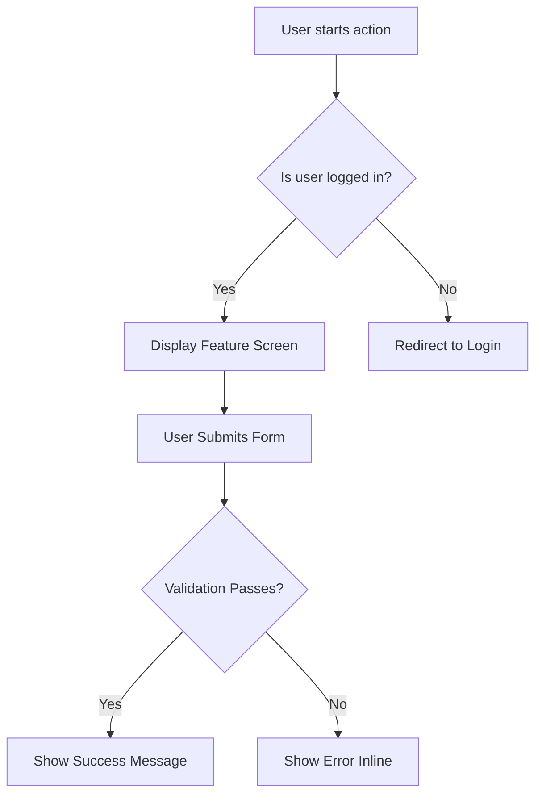
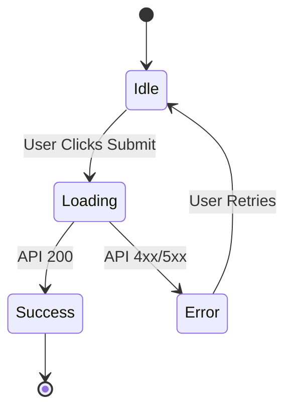

# Functional Specifications: [Feature Name]

## 1. General Overview

- **Global Vision:** [What problem are we solving and why?]
- **Business Goals:** [KPIs, user value proposition]
- **Non-Goals (Out of Scope):** [Explicitly state what this specification will NOT cover. Crucial
  for AI scoping.]

## 2. Business Process & Decision Workflow

_Detailed navigation and user decision matrix:_

## 3. Detailed UI/UX Requirements

- **Required Visual Elements:** [Buttons, forms, alerts, text fields]
- **UI State Machine (States & Transitions):**

## 4. User Stories & Business Rules

- **User Stories:**
  - _As a_ [Persona], _I want to_ [Action] _so that_ [Benefit].
- **Business Rules Matrix:**
  - **BR-01:** [e.g., An invoice can only be generated if the client's country is valid.]
  - **BR-02:** [e.g., Users can only retry payment 3 times before account lockout.]

## 5. Acceptance Criteria (QA)

- [ ] **Nominal Scenario:** Given [context], when [action], then [expected success result].
- [ ] **Functional Error Scenario:** Given [invalid user input], when [action], then [expected
      inline validation message].
