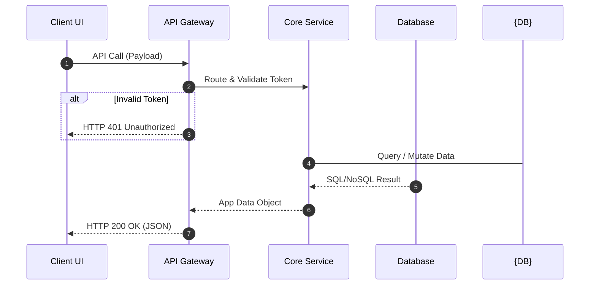
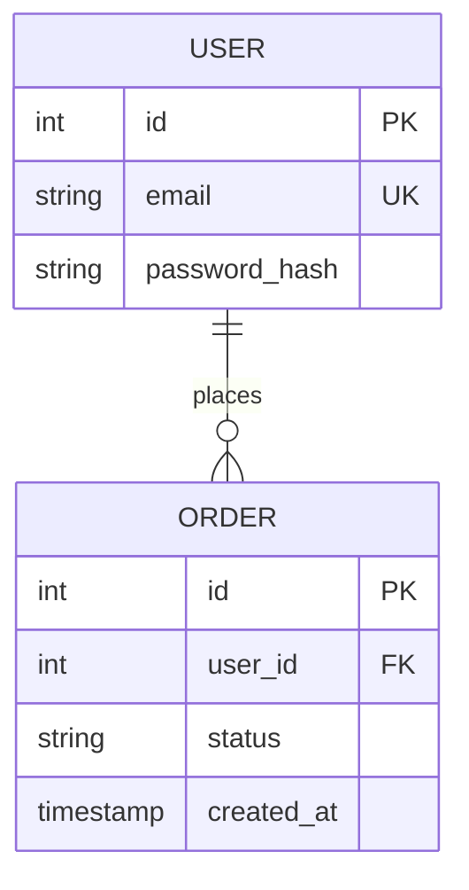

# Technical Specifications: [Component/Feature Name]

## 1. Context & Functional Reference

- **Target Feature:** Link or reference to `functional-spec.md`.
- **Tech Stack Constraints:** [e.g., Use existing Tailwind tokens, React hooks only, no external
  library additions]

## 2. System Architecture & Data Flow

_Data lifecycle, internal API transitions and system boundary interactions:_

## 3. Database Entity Relationship Diagram (ERD)

_Schema updates, new tables, indices, or constraints:_

## 4. Data Model & API Contracts

- **Endpoints / Methods:** `[METHOD] /api/v1/[path]`
- **Payload Constraints:** Required fields, type constraints (e.g., `string`, `uuid`), and regex
  validations.

## 5. Technical Edge Cases & Error Handling

- **EC-01 (Network/Backend Error):** Expected behavior, retry mechanisms, or fallback tokens if the
  API returns a 500 or times out.
- **EC-02 (API Validation Failure):** Structure of the HTTP 400 Bad Request error payload for
  frontend field mapping.

## 6. Performance, Security & Infrastructure

- **Security:** [e.g., JWT Authentication, RBAC Role required, Rate limiting rules]
- **Performance:** [e.g., DB Index requirements, caching strategy, bundle size constraints]
